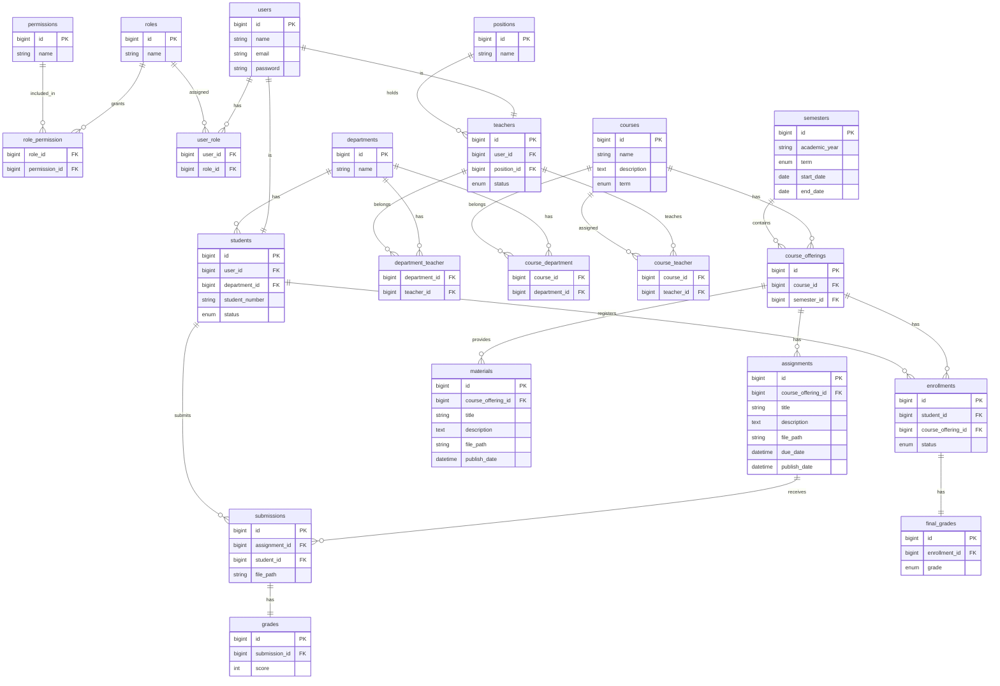

# CampusPortal

# 1. プロジェクト概要

## 1.1 背景

大学では、履修登録・講義資料の配布・課題提出・成績管理などの機能が複数のシステムへ分散しているケースが多く、利用者・管理者の双方に次のような課題があります。

- システム間の移動が多く、操作が煩雑になる
- 情報が分散し、履修計画や講義管理がしづらい
- 教員は複数システムを横断して管理する必要がある
- 学期ごとのデータ管理や保守の負担が大きい

## 1.2 目的

CampusPortalでは、履修登録から成績管理までを単一のWebアプリケーションへ統合し、学生・教員・管理者が共通のプラットフォーム上で利用できる環境を提供します。

また、機能追加や制度変更に対応しやすいよう、保守性・拡張性を考慮したアーキテクチャを採用しています。

## 1.3 主な機能

### 学生

- 履修登録・取消
- 講義資料の閲覧・ダウンロード
- 課題の提出・再提出
- 課題評価・最終成績の確認

### 教員

- 担当講義の管理
- 講義資料の作成・更新・削除
- 課題の作成・更新・削除
- 課題採点
- 最終成績の登録・更新

### 管理者

- ユーザー管理
- 学科・職位管理
- 学期管理
- 講義管理
- 開講管理
- ロール・権限管理

# 2. システム概要（ユースケース）

本システムでは、**Student・Teacher・Admin** の3種類のユーザーを対象とし、それぞれの権限に応じた機能を提供します。

## 2.1 Student

学生は履修および学習活動を行います。

### 主な機能

- 開講講義の一覧表示
- 履修登録・履修取消
- 講義資料の閲覧・ダウンロード
- 課題提出・再提出
- 課題評価の確認
- 最終成績の確認

## 2.2 Teacher

教員は担当講義の運営および評価を担当します。

### 主な機能

- 担当講義の管理
- 講義資料の作成・更新・削除
- 課題の作成・更新・削除
- 提出物の採点
- 最終成績の登録・更新

## 2.3 Admin

管理者はシステム全体の管理を担当します。

### 管理対象

- Student
- Teacher
- Department
- Position
- Semester
- Course
- CourseOffering
- Role
- Permission

### 主な機能

- 登録
- 更新
- 削除
- 開講

# 3. システム設計

## 3.1 設計方針

本システムでは、責務の分離と保守性・拡張性を重視し、以下の設計思想を採用しています。

### Domain Driven Design（DDD）

業務ルールをDomain層へ集約し、UIやデータベースへの依存を最小限に抑えます。

### CQRS

更新処理（Command）と参照処理（Query）を分離することで、責務を明確化し、保守性を向上させます。

### SOLID Principles

SOLID原則に基づき、各クラスが単一責務となるよう設計します。

### RBAC（Role-Based Access Control）

ユーザーへ直接権限を付与するのではなく、Roleを介してPermissionを割り当てることで、柔軟なアクセス制御を実現します。

## 3.2 技術スタック

| 分類     | 技術       |
| -------- | ---------- |
| Backend  | Laravel    |
| Frontend | Inertia.js |
| UI       | React      |
| Language | TypeScript |
| Database | MySQL      |

## 3.3 レイヤー構成

本システムでは、レイヤードアーキテクチャを採用し、各層の責務を明確に分離しています。

| レイヤー       | 責務                                                             |
| -------------- | ---------------------------------------------------------------- |
| Http           | リクエスト受付、バリデーション、認可、レスポンス                 |
| Application    | ユースケースの実行、Command・Queryの制御                         |
| Domain         | 業務ルール、Entity、Value Object、Repository Interface           |
| Infrastructure | Repository実装、Eloquent、データベースアクセス、外部サービス連携 |

各レイヤーは上位層から下位層へ依存し、**Domain層がフレームワークへ依存しない設計**を目指しています。

# 4. ディレクトリ構成

本システムでは、DDD（Domain Driven Design）を採用し、レイヤーごとに責務を分離しています。

```text
app/

├── Domain/
│   ├── User/
│   │   ├── User.php
│   │   ├── UserId.php
│   │   └── UserRepositoryInterface.php
│   │
│
├── Application/
│   ├── Command/
│   ├── Query/
│   └── DTO/
│
├── Infrastructure/
│   ├── Persistence/
│   │   ├── Models/
│   │   ├── Repository/
│   │   └── QueryService/
│   │
│   └── Provider/
│
└── Http/
    ├── Controllers/
    ├── Requests/
    ├── Resources/
    ├── Middleware/
    └── Policies/
```

## 各ディレクトリの責務

| ディレクトリ   | 責務                                                                   |
| -------------- | ---------------------------------------------------------------------- |
| Domain         | ドメインモデル、Value Object、Repository Interfaceなど業務ルールを定義 |
| Application    | ユースケースの実装、Command・Query・DTOを管理                          |
| Infrastructure | 永続化処理やRepository実装、外部サービスとの連携                       |
| Http           | Controller、Request、PolicyなどHTTP層を担当                            |

# 5. ドメインモデル

本システムで扱うドメインモデルを以下に示します。

## ユーザー・組織

- User
- Student
- Teacher
- Department
- Position

Userは認証情報を保持し、StudentまたはTeacherとしてシステムを利用します。

## 講義管理

- Course
- CourseOffering
- Semester

### Course

講義そのものを表すマスタデータです。

例

- Webプログラミング
- データベース
- 情報数学

### CourseOffering

学期ごとに開講される講義を表します。

例えば「Webプログラミング」は毎年開講されますが、

- 2026年度 前期
- 2026年度 後期

は異なるCourseOfferingとして管理します。

## 学習コンテンツ

- Material
- Assignment

CourseOfferingに紐付き、講義資料や課題を管理します。

## 履修・学習活動

- Enrollment
- Submission
- Grade
- FinalGrade

Enrollmentは学生と開講講義の関係を表し、Submission・Grade・FinalGradeを通じて学習活動および評価を管理します。

## 権限管理

- Role
- Permission

RBAC（Role-Based Access Control）により、Roleを介してPermissionをユーザーへ付与します。

# 6. データベース設計

## 設計方針

ER図を示す前に、本システムにおける主要なエンティティの役割を整理します。

- Userは認証情報を管理する基底エンティティです。
- Student・TeacherはUserと1対1で関連付けられます。
- Courseは講義マスタを表します。
- CourseOfferingは学期ごとの開講情報を表します。
- StudentはEnrollmentを介してCourseOfferingへ履修登録します。
- MaterialおよびAssignmentはCourseOfferingに属します。
- FinalGradeはEnrollment単位で管理します。

この構成により、講義マスタと学期ごとの開講情報を分離し、毎学期の再利用や履修履歴を柔軟に管理できる設計としています。

## 6.1 ER図



## 6.2 テーブル設計

本システムで使用する各テーブルの制約を示します。

### 命名規約

| 項目         | ルール                                        |
| ------------ | --------------------------------------------- |
| テーブル名   | 複数形（例: `users`, `courses`）              |
| 主キー       | `id`                                          |
| 外部キー     | `<entity>_id`（例: `user_id`, `course_id`）   |
| 中間テーブル | `<entity1>_<entity2>`（例: `course_teacher`） |

### 制約方針

- 必須項目は **NOT NULL** とする
- 重複を許可しない項目は **UNIQUE** 制約を付与する
- リレーションは **外部キー制約** により整合性を保証する
- 状態を持つ項目は **ENUM** で管理する
- 関係テーブルでは **複合UNIQUE** により重複登録を防止する

### users

| 項目     | 制約     |
| -------- | -------- |
| name     | NOT NULL |
| email    | UNIQUE   |
| password | HASHED   |

### roles

| 項目 | 制約   |
| ---- | ------ |
| name | UNIQUE |

### permissions

| 項目 | 制約   |
| ---- | ------ |
| name | UNIQUE |

### role_permission

| 項目                     | 制約   |
| ------------------------ | ------ |
| (role_id, permission_id) | UNIQUE |

### user_role

| 項目               | 制約   |
| ------------------ | ------ |
| (user_id, role_id) | UNIQUE |

### departments

| 項目 | 制約   |
| ---- | ------ |
| name | UNIQUE |

### positions

| 項目 | 制約   |
| ---- | ------ |
| name | UNIQUE |

### students

| 項目           | 制約                                                  |
| -------------- | ----------------------------------------------------- |
| user_id        | UNIQUE                                                |
| student_number | UNIQUE                                                |
| status         | ENUM (`active`, `suspended`, `expelled`, `graduated`) |

### teachers

| 項目        | 制約                                    |
| ----------- | --------------------------------------- |
| user_id     | UNIQUE                                  |
| position_id | NULLABLE                                |
| status      | ENUM (`active`, `suspended`, `retired`) |

### department_teacher

| 項目                        | 制約   |
| --------------------------- | ------ |
| (department_id, teacher_id) | UNIQUE |

### courses

| 項目        | 制約                 |
| ----------- | -------------------- |
| name        | UNIQUE               |
| description | NULLABLE             |
| term        | ENUM (`1`, `2`, `3`) |

### course_department

| 項目                       | 制約   |
| -------------------------- | ------ |
| (course_id, department_id) | UNIQUE |

### course_teacher

| 項目                    | 制約   |
| ----------------------- | ------ |
| (course_id, teacher_id) | UNIQUE |

### semesters

| 項目                  | 制約                 |
| --------------------- | -------------------- |
| academic_year         | NOT NULL             |
| term                  | ENUM (`1`, `2`, `3`) |
| start_date            | NOT NULL             |
| end_date              | NOT NULL             |
| (academic_year, term) | UNIQUE               |

### course_offerings

| 項目                     | 制約   |
| ------------------------ | ------ |
| (course_id, semester_id) | UNIQUE |

### enrollments

| 項目                             | 制約                                      |
| -------------------------------- | ----------------------------------------- |
| (student_id, course_offering_id) | UNIQUE                                    |
| status                           | ENUM (`enrolled`, `dropped`, `completed`) |

### materials

| 項目         | 制約     |
| ------------ | -------- |
| title        | NOT NULL |
| description  | NULLABLE |
| file_path    | NULLABLE |
| publish_date | NULLABLE |

### assignments

| 項目         | 制約     |
| ------------ | -------- |
| title        | NOT NULL |
| description  | NULLABLE |
| file_path    | NULLABLE |
| due_date     | NULLABLE |
| publish_date | NULLABLE |

### submissions

| 項目                        | 制約   |
| --------------------------- | ------ |
| (assignment_id, student_id) | UNIQUE |
| file_path                  | NOT NULL |

### grades

| 項目          | 制約               |
| ------------- | ------------------ |
| submission_id | UNIQUE             |
| score         | 0〜100（NOT NULL） |

### final_grades

| 項目          | 制約                           |
| ------------- | ------------------------------ |
| enrollment_id | UNIQUE                         |
| grade         | ENUM (`S`, `A`, `B`, `C`, `F`) |

# 7. 状態遷移

本システムでは、学生・教員・履修情報の状態を管理し、それぞれの業務に応じた状態遷移を定義しています。

## 7.1 Student Status

学生の在籍状態を管理します。

```text
active（在学）
├── suspended（停学）
│      └── active
├── graduated（卒業）
└── expelled（除籍）
```

## 7.2 Teacher Status

教員の在職状態を管理します。

```text
active（在職）
├── suspended（停職）
│      └── active
└── retired（退職）
```

## 7.3 Enrollment Status

履修情報の状態を管理します。

```text
enrolled（履修中）
├── dropped（履修取消）
└── completed（履修完了）
```

# 8. 業務フロー

本章では、システムで提供する主要機能の業務フローを示します。

## 8.1 履修登録

1. **Student** が履修する **CourseOffering** を選択する。
2. 履修の登録で **Enrollment** を作成・保存する。
3. 履修の取消で `status = dropped` に更新する。
4. 最終成績の登録で `status = completed` に更新する。

## 8.2 資料管理

1. **Teacher** が担当する **CourseOffering** を選択する。
2. 資料のアップロードで **Material** を作成・保存する。
4. `publish_date` に達すると **Student** に公開される。

## 8.3 課題管理

1. **Teacher** が **CourseOffering** を選択する。
2. 課題の作成で **Assignment** を作成・保存する。
4. `publish_date` に達すると **Student** に公開される。

## 8.4 課題提出

1. **Student** が **Assignment** を選択する。
2. 提出物のアップロードで **Submission** を作成・保存する。
3. `due_date` 以内であれば，再提出も可能である。

## 8.5 課題採点

1. **Teacher** が **Submission** を選択する。
2. 点数の入力で **Grade** を作成・保存する。

## 8.6 最終成績管理

1. **Teacher** が **CourseOffering** を選択する。
2. **Enrollment** ごとに **FinalGrade** を作成・保存する。
4. **Enrollment** の状態を `completed` に更新する。

## 8.7 ユーザー管理

1. **Admin** が **User** を作成する。
2. **Student** または **Teacher** として **Role** を割り当てる。
3. **Department**・**Position** を設定する。

## 8.8 講義管理

1. **Admin** が **Course** を登録する。
2. **Department** および **Teacher** を関連付ける。
3. **Semester** ごとに **CourseOffering** を作成する。
4. **Semester** 単位で開講講義を管理する。

# 9. API（Route）設計

本システムではRESTfulな設計を基本とし、リソースごとにAPIを提供します。

## 設計方針

- リソース指向のURL設計を採用
- HTTPメソッドにより操作内容を表現
- Role（RBAC）によるアクセス制御を実施
- 管理者専用APIには `/admin` プレフィックスを付与
- 親子関係を持つリソースはネストしたURLで表現

## 9.1 認証

| Method | Path      | Controller            | Student | Teacher | Admin |
| ------ | --------- | --------------------- | :-----: | :-----: | :---: |
| GET    | `/login`  | AuthController@index  |    ○    |    ○    |   ○   |
| POST   | `/login`  | AuthController@login  |    ○    |    ○    |   ○   |
| POST   | `/logout` | AuthController@logout |    ○    |    ○    |   ○   |

## 9.2 ダッシュボード

ログインユーザーのロールに応じて表示内容を切り替えます。

- **Student**：履修講義一覧
- **Teacher**：担当講義一覧
- **Admin**：管理メニュー

| Method | Path         | Controller                | Student | Teacher | Admin |
| ------ | ------------ | ------------------------- | :-----: | :-----: | :---: |
| GET    | `/dashboard` | DashboardController@index |    ○    |    ○    |   ○   |

## 9.3 ユーザー管理

| Method | Path                | Controller             | Student | Teacher | Admin |
| ------ | ------------------- | ---------------------- | :-----: | :-----: | :---: |
| GET    | `/admin/users`      | UserController@index   |    ×    |    ×    |   ○   |
| POST   | `/admin/users`      | UserController@store   |    ×    |    ×    |   ○   |
| GET    | `/admin/users/{id}` | UserController@show    |    ×    |    ×    |   ○   |
| PUT    | `/admin/users/{id}` | UserController@update  |    ×    |    ×    |   ○   |
| DELETE | `/admin/users/{id}` | UserController@destroy |    ×    |    ×    |   ○   |

## 9.4 教員管理

| Method | Path                   | Controller                | Student | Teacher | Admin |
| ------ | ---------------------- | ------------------------- | :-----: | :-----: | :---: |
| GET    | `/admin/teachers`      | TeacherController@index   |    ×    |    ×    |   ○   |
| POST   | `/admin/teachers`      | TeacherController@store   |    ×    |    ×    |   ○   |
| GET    | `/admin/teachers/{id}` | TeacherController@show    |    ×    |    ×    |   ○   |
| PUT    | `/admin/teachers/{id}` | TeacherController@update  |    ×    |    ×    |   ○   |
| DELETE | `/admin/teachers/{id}` | TeacherController@destroy |    ×    |    ×    |   ○   |

## 9.5 学科管理

| Method | Path                      | Controller                   | Student | Teacher | Admin |
| ------ | ------------------------- | ---------------------------- | :-----: | :-----: | :---: |
| GET    | `/admin/departments`      | DepartmentController@index   |    ×    |    ×    |   ○   |
| POST   | `/admin/departments`      | DepartmentController@store   |    ×    |    ×    |   ○   |
| GET    | `/admin/departments/{id}` | DepartmentController@show    |    ×    |    ×    |   ○   |
| PUT    | `/admin/departments/{id}` | DepartmentController@update  |    ×    |    ×    |   ○   |
| DELETE | `/admin/departments/{id}` | DepartmentController@destroy |    ×    |    ×    |   ○   |

## 9.6 職位管理

| Method | Path                    | Controller                 | Student | Teacher | Admin |
| ------ | ----------------------- | -------------------------- | :-----: | :-----: | :---: |
| GET    | `/admin/positions`      | PositionController@index   |    ×    |    ×    |   ○   |
| POST   | `/admin/positions`      | PositionController@store   |    ×    |    ×    |   ○   |
| GET    | `/admin/positions/{id}` | PositionController@show    |    ×    |    ×    |   ○   |
| PUT    | `/admin/positions/{id}` | PositionController@update  |    ×    |    ×    |   ○   |
| DELETE | `/admin/positions/{id}` | PositionController@destroy |    ×    |    ×    |   ○   |

## 9.7 学期管理

| Method | Path                    | Controller                 | Student | Teacher | Admin |
| ------ | ----------------------- | -------------------------- | :-----: | :-----: | :---: |
| GET    | `/admin/semesters`      | SemesterController@index   |    ×    |    ×    |   ○   |
| POST   | `/admin/semesters`      | SemesterController@store   |    ×    |    ×    |   ○   |
| GET    | `/admin/semesters/{id}` | SemesterController@show    |    ×    |    ×    |   ○   |
| PUT    | `/admin/semesters/{id}` | SemesterController@update  |    ×    |    ×    |   ○   |
| DELETE | `/admin/semesters/{id}` | SemesterController@destroy |    ×    |    ×    |   ○   |

## 9.8 講義管理

| Method | Path                  | Controller               | Student | Teacher | Admin |
| ------ | --------------------- | ------------------------ | :-----: | :-----: | :---: |
| GET    | `/courses`            | CourseController@index   |    ○    |    ○    |   ○   |
| POST   | `/admin/courses`      | CourseController@store   |    ×    |    ×    |   ○   |
| GET    | `/courses/{id}`       | CourseController@show    |    ○    |    ○    |   ○   |
| PUT    | `/admin/courses/{id}` | CourseController@update  |    ×    |    ×    |   ○   |
| DELETE | `/admin/courses/{id}` | CourseController@destroy |    ×    |    ×    |   ○   |

## 9.9 開講管理

| Method | Path                                     | Controller                       | Student | Teacher | Admin |
| ------ | ---------------------------------------- | -------------------------------- | :-----: | :-----: | :---: |
| GET    | `/semesters/{id}/course-offerings`       | CourseOfferingController@index   |    ○    |    ○    |   ○   |
| POST   | `/admin/semesters/{id}/course-offerings` | CourseOfferingController@store   |    ×    |    ×    |   ○   |
| GET    | `/course-offerings/{id}`                 | CourseOfferingController@show    |    ○    |    ○    |   ○   |
| PUT    | `/admin/course-offerings/{id}`           | CourseOfferingController@update  |    ×    |    ×    |   ○   |
| DELETE | `/admin/course-offerings/{id}`           | CourseOfferingController@destroy |    ×    |    ×    |   ○   |

## 9.10 資料管理

| Method | Path                               | Controller                 | Student | Teacher | Admin |
| ------ | ---------------------------------- | -------------------------- | :-----: | :-----: | :---: |
| GET    | `/course-offerings/{id}/materials` | MaterialController@index   |    ○    |    ○    |   ○   |
| POST   | `/course-offerings/{id}/materials` | MaterialController@store   |    ×    |    ○    |   ×   |
| GET    | `/materials/{id}`                  | MaterialController@show    |    ○    |    ○    |   ○   |
| PUT    | `/materials/{id}`                  | MaterialController@update  |    ×    |    ○    |   ×   |
| DELETE | `/materials/{id}`                  | MaterialController@destroy |    ×    |    ○    |   ×   |

## 9.11 課題管理

| Method | Path                                 | Controller                   | Student | Teacher | Admin |
| ------ | ------------------------------------ | ---------------------------- | :-----: | :-----: | :---: |
| GET    | `/course-offerings/{id}/assignments` | AssignmentController@index   |    ○    |    ○    |   ○   |
| POST   | `/course-offerings/{id}/assignments` | AssignmentController@store   |    ×    |    ○    |   ×   |
| GET    | `/assignments/{id}`                  | AssignmentController@show    |    ○    |    ○    |   ○   |
| PUT    | `/assignments/{id}`                  | AssignmentController@update  |    ×    |    ○    |   ×   |
| DELETE | `/assignments/{id}`                  | AssignmentController@destroy |    ×    |    ○    |   ×   |

## 9.12 提出管理

| Method | Path                            | Controller                   | Student | Teacher | Admin |
| ------ | ------------------------------- | ---------------------------- | :-----: | :-----: | :---: |
| GET    | `/assignments/{id}/submissions` | SubmissionController@index   |    ×    |    ○    |   ○   |
| POST   | `/assignments/{id}/submissions` | SubmissionController@store   |    ○    |    ×    |   ×   |
| GET    | `/submissions/{id}`             | SubmissionController@show    |    ○    |    ○    |   ○   |
| PUT    | `/submissions/{id}`             | SubmissionController@update  |    ○    |    ×    |   ×   |
| DELETE | `/submissions/{id}`             | SubmissionController@destroy |    ○    |    ×    |   ×   |

## 9.13 採点管理

| Method | Path                      | Controller              | Student | Teacher | Admin |
| ------ | ------------------------- | ----------------------- | :-----: | :-----: | :---: |
| GET    | `/submissions/{id}/grade` | GradeController@show    |    ○    |    ○    |   ○   |
| POST   | `/submissions/{id}/grade` | GradeController@store   |    ×    |    ○    |   ○   |
| PUT    | `/grades/{id}`            | GradeController@update  |    ×    |    ○    |   ○   |
| DELETE | `/grades/{id}`            | GradeController@destroy |    ×    |    ○    |   ○   |

## 9.14 最終成績管理

| Method | Path                                  | Controller                   | Student | Teacher | Admin |
| ------ | ------------------------------------- | ---------------------------- | :-----: | :-----: | :---: |
| GET    | `/course-offerings/{id}/final-grades` | FinalGradeController@index   |    ×    |    ○    |   ○   |
| POST   | `/enrollments/{id}/final-grade`       | FinalGradeController@store   |    ×    |    ○    |   ○   |
| PUT    | `/enrollments/{id}/final-grade`       | FinalGradeController@update  |    ×    |    ○    |   ○   |
| DELETE | `/enrollments/{id}/final-grade`       | FinalGradeController@destroy |    ×    |    ○    |   ○   |
| GET    | `/final-grades`                       | FinalGradeController@index   |    ○    |    ○    |   ○   |

# 10. 開発環境構築

本プロジェクトはDocker Composeを利用して開発環境を構築します。

## 動作環境

- Docker
- Docker Compose
- Git

## 10.1 リポジトリの取得

```bash
git clone https://github.com/HAL0716/CampusPortal.git
cd CampusPortal
```

## 10.2 コンテナの起動

```bash
docker compose up -d --build
```

コンテナが起動したら、各サービスが正常に立ち上がっていることを確認してください。

## 10.3 アプリケーションへのアクセス

ブラウザで以下へアクセスします。

```text
http://localhost:8080
```

## 10.4 データベースの初期化

### Migration

データベーステーブルを作成します。

```bash
docker compose exec app php artisan migrate
```

### Seeder

初期データを投入します。

```bash
docker compose exec app php artisan db:seed
```

MigrationとSeederをまとめて実行する場合は、以下のコマンドを使用します。

```bash
docker compose exec app php artisan migrate --seed
```

## 10.5 テストの実行

```bash
docker compose exec app php artisan test
```

## 10.6 コード品質チェック

### Backend

Laravel Pint

```bash
docker compose exec app composer pint
```

### Frontend

ESLint

```bash
docker compose exec node npm run lint
```

ESLint（自動修正）

```bash
docker compose exec node npm run lint:fix
```

Prettier

```bash
docker compose exec node npm run format
```

フォーマットチェック

```bash
docker compose exec node npm run format:check
```

一括チェック

```bash
docker compose exec node npm run check
```

# 11. 開発ルール

## 11.1 コーディング規約

### Backend

- PSR-12
- Laravel Pint

Laravelの標準規約に準拠し、Pintによるコードフォーマットを適用します。

### Frontend

- Airbnb JavaScript Style Guide
- ESLint
- Prettier

ESLintによる静的解析とPrettierによるコードフォーマットを適用し、コードスタイルを統一します。

## 11.2 コミットメッセージ

Conventional Commitsを採用します。

| Prefix   | 内容                 |
| -------- | -------------------- |
| feat     | 新機能追加           |
| fix      | バグ修正             |
| docs     | ドキュメント更新     |
| refactor | リファクタリング     |
| test     | テスト追加・修正     |
| chore    | ビルド・設定変更など |

## 11.4 Pull Request

Pull Requestには以下を記載します。

- 変更内容
- 実装理由

## 11.5 品質基準

マージ前に以下を満たすことを推奨します。

- Laravel Pintが成功する
- ESLintが成功する
- Prettierが成功する
- テストが成功する
- ビルドが成功する

## 12. 今後の予定

- お知らせ機能
- メッセージ機能
- 出席管理
- 時間割表示
- GPA計算
- 通知機能
- CSVインポート・エクスポート
- ダッシュボードの強化
