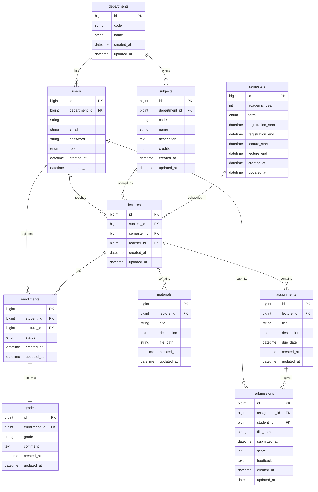
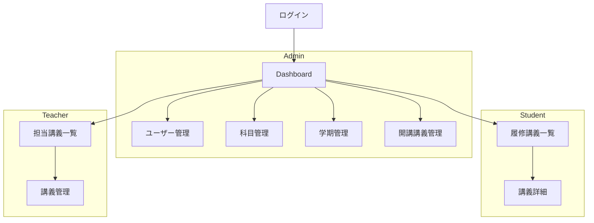

# CampusPortal

## 1. 解決したい課題

### 課題

- 履修登録、講義資料共有、課題提出、成績確認が別々のシステムで管理されている
- 利用目的ごとに複数サイトを行き来する必要がある
- 情報が分散しており履修計画が立てづらい
- 教員側も複数システムで管理業務を行う必要がある

### 解決方法

履修登録、講義管理、資料共有、課題提出、成績管理を単一のWebアプリケーションに統合し、学生・教員・管理者が大学生活に必要な操作を一元的に行える環境を提供する。

---

## 2. 想定ユーザ・ロール

| Role    | 権限                                             |
| ------- | ------------------------------------------------ |
| Admin   | ユーザー管理、科目管理、学期管理、開講講義管理   |
| Student | 履修登録、資料閲覧、課題提出、成績確認           |
| Teacher | 担当講義管理、資料管理、課題管理、採点、成績入力 |

---

## 3. 機能一覧

| 機能         | 内容               | 優先度 |
| ------------ | ------------------ | ------ |
| 認証         | Login / Logout     | 必須   |
| ユーザー管理 | CRUD               | 必須   |
| 科目管理     | CRUD               | 必須   |
| 学期管理     | CRUD               | 必須   |
| 開講講義管理 | CRUD               | 必須   |
| 履修登録     | 登録 / 取消        | 必須   |
| 講義資料共有 | Upload / Download  | 必須   |
| 課題管理     | 作成 / 提出 / 採点 | 必須   |
| 成績管理     | 入力 / 閲覧        | 必須   |
| 通知         | 締切通知、成績通知 | 推奨   |

---

## 4. DB設計



---

## 5. 画面構成・遷移



---

## 6. Route / Controller設計

### 認証

| Method | URI     | Controller                  | 説明         |
| ------ | ------- | --------------------------- | ------------ |
| GET    | /login  | AuthController@login        | ログイン画面 |
| POST   | /login  | AuthController@authenticate | ログイン処理 |
| POST   | /logout | AuthController@logout       | ログアウト   |

---

### Admin

| Method | URI                 | Controller             | 説明 |
| ------ | ------------------- | ---------------------- | ---- |
| GET    | /admin/users        | UserController@index   | 一覧 |
| POST   | /admin/users        | UserController@store   | 作成 |
| PUT    | /admin/users/{user} | UserController@update  | 更新 |
| DELETE | /admin/users/{user} | UserController@destroy | 削除 |

| Method | URI                       | Controller                | 説明 |
| ------ | ------------------------- | ------------------------- | ---- |
| GET    | /admin/subjects           | SubjectController@index   |
| POST   | /admin/subjects           | SubjectController@store   |
| PUT    | /admin/subjects/{subject} | SubjectController@update  |
| DELETE | /admin/subjects/{subject} | SubjectController@destroy |

| Method | URI                         | Controller                 | 説明 |
| ------ | --------------------------- | -------------------------- | ---- |
| GET    | /admin/semesters            | SemesterController@index   |
| POST   | /admin/semesters            | SemesterController@store   |
| PUT    | /admin/semesters/{semester} | SemesterController@update  |
| DELETE | /admin/semesters/{semester} | SemesterController@destroy |

| Method | URI                       | Controller                | 説明 |
| ------ | ------------------------- | ------------------------- | ---- |
| GET    | /admin/lectures           | LectureController@index   |
| POST   | /admin/lectures           | LectureController@store   |
| PUT    | /admin/lectures/{lecture} | LectureController@update  |
| DELETE | /admin/lectures/{lecture} | LectureController@destroy |

---

### Student

| Method | URI                                   | Controller                   | 説明         |
| ------ | ------------------------------------- | ---------------------------- | ------------ |
| GET    | /lectures                             | LectureController@index      | 履修講義一覧 |
| GET    | /lectures/{lecture}                   | LectureController@show       | 講義詳細     |
| POST   | /lectures/{lecture}/enroll            | EnrollmentController@store   | 履修登録     |
| DELETE | /lectures/{lecture}/enroll            | EnrollmentController@destroy | 履修取消     |
| POST   | /assignments/{assignment}/submissions | SubmissionController@store   | 課題提出     |

---

### Teacher

| Method | URI                                     | Controller                     | 説明         |
| ------ | --------------------------------------- | ------------------------------ | ------------ |
| GET    | /teacher/lectures                       | TeacherLectureController@index | 担当講義一覧 |
| GET    | /teacher/lectures/{lecture}             | TeacherLectureController@show  | 講義管理     |
| POST   | /teacher/lectures/{lecture}/materials   | MaterialController@store       | 資料登録     |
| POST   | /teacher/lectures/{lecture}/assignments | AssignmentController@store     | 課題作成     |
| PUT    | /teacher/submissions/{submission}/score | SubmissionController@score     | 採点         |
| PUT    | /teacher/enrollments/{enrollment}/grade | GradeController@store          | 成績入力     |

---

## 7. Model設計

### User

```php
User
 ├─ hasMany(Lecture,'teacher_id')
 ├─ hasMany(Enrollment,'student_id')
 └─ hasMany(Submission,'student_id')
```

### Lecture

```php
Lecture
 ├─ belongsTo(User,'teacher_id')
 ├─ belongsTo(Subject)
 ├─ belongsTo(Semester)
 ├─ hasMany(Material)
 ├─ hasMany(Assignment)
 └─ hasMany(Enrollment)
```

### Enrollment

```php
Enrollment
 ├─ belongsTo(User,'student_id')
 ├─ belongsTo(Lecture)
 └─ hasOne(Grade)
```

---

## 8. Middleware

```txt
auth
role:admin
role:teacher
role:student
```

例:

```php
Route::middleware([
    'auth',
    'role:teacher'
]);
```

---

## 9. Validation

### User

```php
'name' => 'required|max:255',

'email' => 'required|email|unique:users',

'password' => 'required|min:8'
```

### Assignment

```php
'title' => 'required',

'due_date' => 'required|date'
```

### Lecture

```php
'subject_id' => 'required|exists:subjects,id',

'semester_id' => 'required|exists:semesters,id',

'teacher_id' => 'required|exists:users,id'
```

---

## 10. 技術構成

### Backend

- Laravel 13

### Frontend

- Inertia.js
- React
- TailwindCSS

### Database

- MySQL 8

### Environment

- Docker
- Docker Compose

---

## 11. Docker起動方法

起動:

```bash
docker compose up -d --build
```

Laravel起動確認:

```bash
http://localhost:8080
```

migration:

```bash
docker compose exec app php artisan migrate
```

seed:

```bash
docker compose exec app php artisan db:seed
```

---

## 12. 今後の拡張候補

- GPA計算
- 履修上限チェック
- prerequisite（履修条件）
- 通知機能
- コメント機能
- お知らせ掲示板
- 出席管理

---

## 13. 備考

### コードフォーマット

#### フロントエンド（ESLint / Prettier）

コードの静的チェック（エラー検出）

```bash
docker compose exec node npm run lint
```

ESLintによる自動修正

```bash
docker compose exec node npm run lint:fix
```

Prettierによるコード整形（自動修正）

```bash
docker compose exec node npm run format
```

Prettierの整形状態チェック（エラー検出）

```bash
docker compose exec node npm run format:check
```

Lintチェック + フォーマットチェックをまとめて実行

```bash
docker compose exec node npm run check
```

---

#### バックエンド（Laravel）

Laravel PintによるPHPコードフォーマット（PSR準拠）

```bash
docker compose exec app composer pint
```
