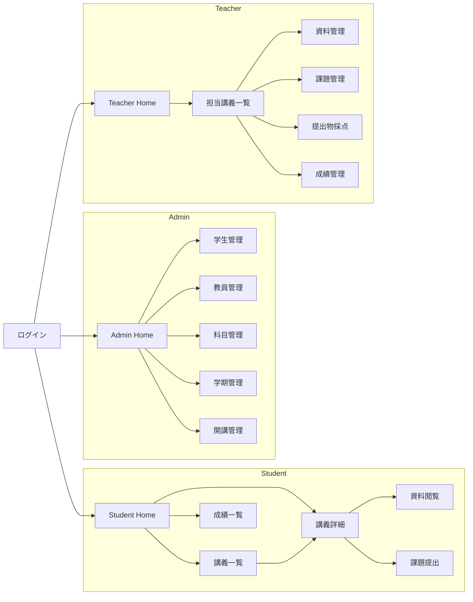
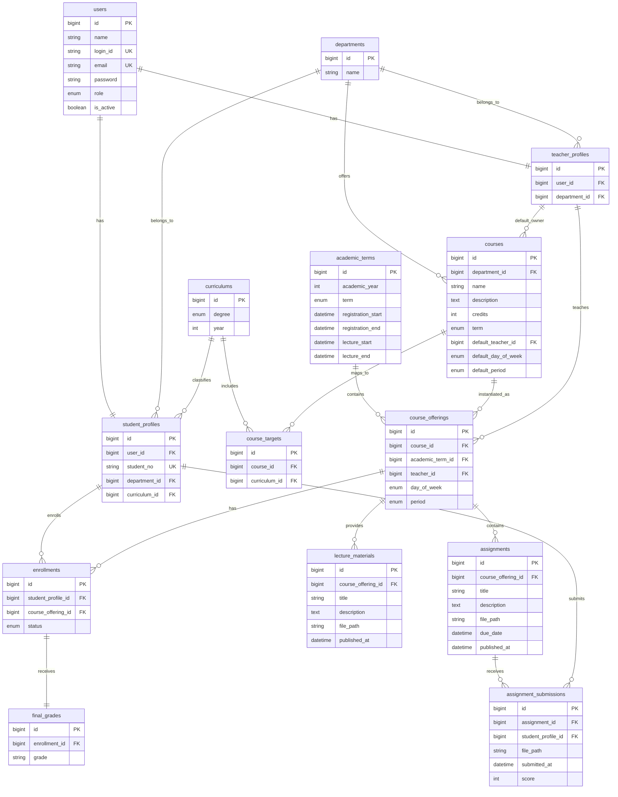

# CampusPortal

## 1. プロジェクト概要

### 1.1 解決したい課題

- 履修登録、講義資料共有、課題提出、成績確認が別々のシステムで管理されている
- 利用目的ごとに複数サイトを行き来する必要がある
- 情報が分散しており履修計画が立てづらい
- 教員側も複数システムで管理業務を行う必要がある
- 学期の切替時にシステム間でのデータ移行が必要となり，メンテナンスが煩雑になる

### 1.2 解決方法

履修登録、講義管理、資料共有、課題提出、成績管理を単一のWebアプリケーションに統合し、学生・教員・管理者が大学生活に必要な操作を一元的に行える環境を提供する。

#### 主な提供機能

- 認証（ログイン／ログアウト）
- 学生管理
- 教員管理
- 科目管理
- 学期管理
- 開講講義管理
- 履修登録
- 講義資料管理
- 課題管理
- 提出物管理
- 成績管理

#### システムの特徴

- 学生・教員・管理者のロールベースアクセス制御
- 履修登録から成績確認までの一元管理
- 講義単位での資料・課題・成績管理
- 学期およびカリキュラムに基づく履修制御
- Web ブラウザから利用可能な統合ポータル

## 2. システム概要

### 2.1 想定ユーザ・ロール

本システムは以下の 3 つのロールを提供する。

| Role    | 説明           | 主な権限                                         |
| ------- | -------------- | ------------------------------------------------ |
| Admin   | システム管理者 | ユーザー管理、科目管理、学期管理、開講管理       |
| Student | 学生           | 履修登録、資料閲覧、課題提出、成績確認           |
| Teacher | 教員           | 担当講義管理、資料管理、課題管理、採点、成績入力 |

### 2.2 機能一覧

システムで提供する機能を以下に示す。

| 機能         | 内容                         | 優先度 |
| ------------ | ---------------------------- | ------ |
| 認証         | Login / Logout               | 1      |
| 履修管理     | 履修登録、履修取消           | 1      |
| 成績管理     | 成績入力、成績閲覧、単位集計 | 1      |
| ユーザー管理 | 学生・教員管理               | 2      |
| 科目管理     | 科目マスタ CRUD              | 2      |
| 学期管理     | 学期 CRUD                    | 2      |
| 開講管理     | 開講講義 CRUD                | 2      |
| 資料管理     | 講義資料 CRUD                | 3      |
| 課題管理     | 課題 CRUD                    | 3      |
| 提出物管理   | 提出、再提出、採点           | 3      |

### 2.3 ロール別利用機能

#### Admin

管理者は大学運営に必要なマスタデータおよびユーザー情報を管理する。

利用可能機能：

- 学生管理
  - 入学
  - 進級
  - 卒業

- 教員管理
  - 受入
  - 離任

- 科目マスタ管理
- 学期管理
- 開講講義管理

#### Student

学生は履修から成績確認までを本システム上で実施する。

利用可能機能：

- 履修登録
- 履修取消
- 開講講義閲覧
- 講義資料閲覧
- 課題提出
- 課題再提出
- 成績確認
- 取得単位確認

#### Teacher

教員は担当講義の運営および成績管理を実施する。

利用可能機能：

- 担当講義管理
- 講義資料管理
- 課題管理
- 提出物確認
- 提出物採点
- 成績入力

### 2.4 システム利用フロー

#### Admin

1. ログイン
2. 学生・教員情報を管理
3. 科目マスタを管理
4. 学期を管理
5. 開講講義を管理

#### Student

1. ログイン
2. 履修登録期間中に講義を履修登録
3. 講義資料を閲覧
4. 課題を提出
5. 成績公開後に成績を確認

#### Teacher

1. ログイン
2. 担当講義を確認
3. 講義資料を公開
4. 課題を作成・公開
5. 提出物を採点
6. 最終成績を入力

## 3. 画面設計

### 3.1 画面遷移図



### 3.2 Admin

管理者は学生・教員・科目・学期・開講講義を管理する。

#### ホーム

##### `/home`

| 項目 | 内容                                                              |
| ---- | ----------------------------------------------------------------- |
| 表示 | 管理メニュー                                                      |
| 遷移 | `/students` `/teachers` `/courses` `/offerings` `/academic-terms` |

#### 学生管理

##### `/students`

| 項目 | 内容                                                        |
| ---- | ----------------------------------------------------------- |
| 表示 | 学籍番号、氏名                                              |
| 遷移 | `/students/enroll` `/students/promote` `/students/graduate` |

##### `/students/enroll`

| 項目 | 内容                                                |
| ---- | --------------------------------------------------- |
| 入力 | 課程、学年、CSV(student_no,name,email)              |
| 操作 | 登録                                                |
| 備考 | login_id=email前半、初期PW付与、CSV出力後一覧へ遷移 |

##### `/students/promote`

| 項目 | 内容                        |
| ---- | --------------------------- |
| 入力 | 課程、学年、CSV(student_no) |
| 操作 | 進級                        |
| 備考 | 成功後一覧へ遷移            |

##### `/students/graduate`

| 項目 | 内容                             |
| ---- | -------------------------------- |
| 入力 | CSV(student_no)                  |
| 操作 | 卒業                             |
| 備考 | ログイン不可化、成功後一覧へ遷移 |

#### 教員管理

##### `/teachers`

| 項目 | 内容                                           |
| ---- | ---------------------------------------------- |
| 表示 | 学科、氏名、Email                              |
| 遷移 | `/teachers/onboarding` `/teachers/offboarding` |

##### `/teachers/onboarding`

| 項目 | 内容                                                |
| ---- | --------------------------------------------------- |
| 入力 | 学科、氏名、Email                                   |
| 操作 | 受入                                                |
| 備考 | login_id=email前半、初期PW付与、CSV出力後一覧へ遷移 |

##### `/teachers/offboarding`

| 項目 | 内容                             |
| ---- | -------------------------------- |
| 入力 | teacher.id                       |
| 操作 | 離任                             |
| 備考 | ログイン不可化、成功後一覧へ遷移 |

#### 科目マスタ管理

##### `/courses`

| 項目 | 内容                   |
| ---- | ---------------------- |
| 表示 | 科目名、単位数         |
| 遷移 | 作成、詳細、編集、削除 |
| 備考 | 学科別表示             |

##### `/courses/create`

##### `/courses/{course}/edit`

| 項目 | 内容                                                         |
| ---- | ------------------------------------------------------------ |
| 入力 | 科目名、概要、単位数、対象課程・学年、学期、曜日、時限、教員 |
| 操作 | 保存、更新                                                   |
| 備考 | 教員離任時は NULL 許可                                       |

##### `/courses/{course}`

| 項目 | 内容                     |
| ---- | ------------------------ |
| 表示 | 科目情報、対象課程・学年 |

##### `/courses/{course}/delete`

| 項目 | 内容             |
| ---- | ---------------- |
| 操作 | 削除             |
| 備考 | 成功後一覧へ遷移 |

#### 学期管理

##### `/academic-terms`

| 項目 | 内容                               |
| ---- | ---------------------------------- |
| 表示 | 年度、学期、履修登録期間、講義期間 |
| 遷移 | 作成、編集                         |

##### `/academic-terms/create`

##### `/academic-terms/{term}/edit`

| 項目 | 内容                                                       |
| ---- | ---------------------------------------------------------- |
| 入力 | 年度、学期、登録開始日、登録終了日、講義開始日、講義終了日 |
| 操作 | 保存、更新                                                 |
| 備考 | 成功後一覧へ遷移                                           |

#### 開講管理

##### `/offerings`

| 項目 | 内容                         |
| ---- | ---------------------------- |
| 表示 | 年度、学期、科目名、担当教員 |
| 遷移 | 作成、詳細、編集、削除       |

##### `/offerings/create`

| 項目 | 内容                               |
| ---- | ---------------------------------- |
| 入力 | 科目、年度、学期                   |
| 操作 | 作成                               |
| 備考 | 科目マスタ設定を初期値としてコピー |

##### `/offerings/{offering}/edit`

| 項目 | 内容                 |
| ---- | -------------------- |
| 入力 | 担当教員、曜日、時限 |
| 操作 | 更新                 |

##### `/offerings/{offering}/delete`

| 項目 | 内容 |
| ---- | ---- |
| 操作 | 削除 |

##### `/offerings/{offering}`

| 項目 | 内容                         |
| ---- | ---------------------------- |
| 表示 | 開講情報、資料一覧、課題一覧 |
| 遷移 | 資料管理、課題管理、成績管理 |

### 3.3 Student

学生は履修登録、講義受講、課題提出、成績確認を行う。

#### ホーム

##### `/home`

| 項目 | 内容                                           |
| ---- | ---------------------------------------------- |
| 表示 | 履修講義（時間割）、取得単位数、履修単位数     |
| 操作 | 履修登録、履修取消                             |
| 備考 | 履修登録期間内のみ操作可能                     |
| 遷移 | `/offerings` `/offerings/{offering}` `/grades` |

#### 講義一覧

##### `/offerings`

| 項目 | 内容                    |
| ---- | ----------------------- |
| 表示 | 開講講義一覧            |
| 遷移 | `/offerings/{offering}` |

#### 講義詳細

##### `/offerings/{offering}`

| 項目 | 内容                         |
| ---- | ---------------------------- |
| 表示 | 講義情報、資料一覧、課題一覧 |
| 遷移 | 資料詳細、課題詳細           |

#### 資料閲覧

##### `/offerings/{offering}/materials/{material}`

| 項目 | 内容                         |
| ---- | ---------------------------- |
| 表示 | タイトル、説明、添付ファイル |
| 操作 | ダウンロード                 |

#### 課題提出

##### `/offerings/{offering}/assignments/{assignment}`

| 項目 | 内容                               |
| ---- | ---------------------------------- |
| 表示 | タイトル、説明、提出期限、提出状況 |
| 入力 | 提出ファイル                       |
| 操作 | 提出、再提出                       |
| 備考 | 提出期限内のみ操作可能             |

#### 成績確認

##### `/grades`

| 項目 | 内容                   |
| ---- | ---------------------- |
| 表示 | 科目名、成績、取得単位 |

### 3.4 Teacher

教員は担当講義の運営、課題管理、採点、成績入力を行う。

#### ホーム

##### `/home`

| 項目 | 内容                    |
| ---- | ----------------------- |
| 表示 | 担当講義（時間割）      |
| 遷移 | `/offerings/{offering}` |

#### 担当講義一覧

##### `/offerings`

| 項目 | 内容                    |
| ---- | ----------------------- |
| 表示 | 担当講義一覧            |
| 遷移 | `/offerings/{offering}` |

#### 講義詳細

##### `/offerings/{offering}`

| 項目 | 内容                         |
| ---- | ---------------------------- |
| 表示 | 開講情報                     |
| 遷移 | 資料管理、課題管理、成績管理 |

#### 資料管理

##### `/offerings/{offering}/materials`

| 項目 | 内容             |
| ---- | ---------------- |
| 表示 | 資料一覧         |
| 遷移 | 作成、編集、削除 |

##### `/offerings/{offering}/materials/create`

##### `/offerings/{offering}/materials/{material}/edit`

| 項目 | 内容                                   |
| ---- | -------------------------------------- |
| 入力 | タイトル、説明、添付ファイル、公開日時 |
| 操作 | 保存                                   |

##### `/offerings/{offering}/materials/{material}/delete`

| 項目 | 内容 |
| ---- | ---- |
| 操作 | 削除 |

#### 課題管理

##### `/offerings/{offering}/assignments`

| 項目 | 内容                         |
| ---- | ---------------------------- |
| 表示 | 課題一覧                     |
| 遷移 | 作成、編集、削除、提出物確認 |

##### `/offerings/{offering}/assignments/create`

##### `/offerings/{offering}/assignments/{assignment}/edit`

| 項目 | 内容                                             |
| ---- | ------------------------------------------------ |
| 入力 | タイトル、説明、提出期限、添付ファイル、公開日時 |
| 操作 | 保存                                             |

##### `/offerings/{offering}/assignments/{assignment}/delete`

| 項目 | 内容 |
| ---- | ---- |
| 操作 | 削除 |

#### 提出物管理

##### `/offerings/{offering}/assignments/{assignment}/submissions/{submission}`

| 項目 | 内容                           |
| ---- | ------------------------------ |
| 表示 | 学生名、提出ファイル、提出日時 |
| 入力 | 点数                           |
| 操作 | 保存                           |

#### 成績管理

##### `/offerings/{offering}/grades`

| 項目 | 内容           |
| ---- | -------------- |
| 表示 | 学生別成績一覧 |
| 入力 | 成績           |
| 操作 | 保存           |

#### 画面一覧

| Role    | 画面数 |
| ------- | ------ |
| Admin   | 15     |
| Student | 6      |
| Teacher | 10     |

総画面数：約 30 画面

## 4. Route設計

### 4.1 共通

#### 認証

| Method | URI     | Controller            | 説明         |
| ------ | ------- | --------------------- | ------------ |
| GET    | /login  | AuthController@index  | ログイン画面 |
| POST   | /login  | AuthController@login  | ログイン処理 |
| POST   | /logout | AuthController@logout | ログアウト   |

### 4.2 Admin

#### ホーム

| Method | URI   | Controller           | 説明   |
| ------ | ----- | -------------------- | ------ |
| GET    | /home | HomeController@index | ホーム |

#### 学生管理

| Method | URI                | Controller                 | 説明     |
| ------ | ------------------ | -------------------------- | -------- |
| GET    | /students          | StudentController@index    | 学生一覧 |
| POST   | /students/enroll   | StudentController@enroll   | 入学     |
| POST   | /students/promote  | StudentController@promote  | 進級     |
| POST   | /students/graduate | StudentController@graduate | 卒業     |

#### 教員管理

| Method | URI                   | Controller                    | 説明     |
| ------ | --------------------- | ----------------------------- | -------- |
| GET    | /teachers             | TeacherController@index       | 教員一覧 |
| POST   | /teachers/onboarding  | TeacherController@onboarding  | 受入     |
| POST   | /teachers/offboarding | TeacherController@offboarding | 離任     |

#### 科目マスタ管理

| Method | URI               | Controller               | 説明     |
| ------ | ----------------- | ------------------------ | -------- |
| GET    | /courses          | CourseController@index   | 科目一覧 |
| GET    | /courses/{course} | CourseController@show    | 科目詳細 |
| POST   | /courses          | CourseController@store   | 科目作成 |
| PUT    | /courses/{course} | CourseController@update  | 科目更新 |
| DELETE | /courses/{course} | CourseController@destroy | 科目削除 |

#### 学期管理

| Method | URI                    | Controller                     | 説明     |
| ------ | ---------------------- | ------------------------------ | -------- |
| GET    | /academic-terms        | AcademicTermController@index   | 学期一覧 |
| POST   | /academic-terms        | AcademicTermController@store   | 学期作成 |
| PUT    | /academic-terms/{term} | AcademicTermController@update  | 学期更新 |
| DELETE | /academic-terms/{term} | AcademicTermController@destroy | 学期削除 |

#### 開講管理

| Method | URI                   | Controller                 | 説明     |
| ------ | --------------------- | -------------------------- | -------- |
| GET    | /offerings            | OfferingController@index   | 開講一覧 |
| GET    | /offerings/{offering} | OfferingController@show    | 開講詳細 |
| POST   | /offerings            | OfferingController@store   | 開講作成 |
| PUT    | /offerings/{offering} | OfferingController@update  | 開講更新 |
| DELETE | /offerings/{offering} | OfferingController@destroy | 開講削除 |

### 4.3 Student

#### ホーム

| Method | URI   | Controller           | 説明   |
| ------ | ----- | -------------------- | ------ |
| GET    | /home | HomeController@index | ホーム |

#### 講義

| Method | URI                   | Controller               | 説明     |
| ------ | --------------------- | ------------------------ | -------- |
| GET    | /offerings            | OfferingController@index | 講義一覧 |
| GET    | /offerings/{offering} | OfferingController@show  | 講義詳細 |

#### 履修登録

| Method | URI                       | Controller                   | 説明     |
| ------ | ------------------------- | ---------------------------- | -------- |
| POST   | /enrollments              | EnrollmentController@store   | 履修登録 |
| DELETE | /enrollments/{enrollment} | EnrollmentController@destroy | 履修取消 |

#### 課題提出

| Method | URI                                  | Controller                            | 説明   |
| ------ | ------------------------------------ | ------------------------------------- | ------ |
| POST   | /assignments/{assignment}/submission | AssignmentSubmissionController@store  | 提出   |
| PUT    | /assignments/{assignment}/submission | AssignmentSubmissionController@update | 再提出 |

#### 成績

| Method | URI     | Controller            | 説明     |
| ------ | ------- | --------------------- | -------- |
| GET    | /grades | GradeController@index | 成績一覧 |

### 4.4 Teacher

#### ホーム

| Method | URI   | Controller           | 説明   |
| ------ | ----- | -------------------- | ------ |
| GET    | /home | HomeController@index | ホーム |

#### 担当講義

| Method | URI                   | Controller               | 説明         |
| ------ | --------------------- | ------------------------ | ------------ |
| GET    | /offerings            | OfferingController@index | 担当講義一覧 |
| GET    | /offerings/{offering} | OfferingController@show  | 講義詳細     |

#### 資料管理

| Method | URI                             | Controller                 | 説明     |
| ------ | ------------------------------- | -------------------------- | -------- |
| GET    | /offerings/{offering}/materials | MaterialController@index   | 資料一覧 |
| POST   | /offerings/{offering}/materials | MaterialController@store   | 資料作成 |
| PUT    | /materials/{material}           | MaterialController@update  | 資料更新 |
| DELETE | /materials/{material}           | MaterialController@destroy | 資料削除 |

#### 課題管理

| Method | URI                               | Controller                   | 説明     |
| ------ | --------------------------------- | ---------------------------- | -------- |
| GET    | /offerings/{offering}/assignments | AssignmentController@index   | 課題一覧 |
| POST   | /offerings/{offering}/assignments | AssignmentController@store   | 課題作成 |
| PUT    | /assignments/{assignment}         | AssignmentController@update  | 課題更新 |
| DELETE | /assignments/{assignment}         | AssignmentController@destroy | 課題削除 |

#### 提出物管理

| Method | URI                                   | Controller                           | 説明     |
| ------ | ------------------------------------- | ------------------------------------ | -------- |
| GET    | /assignments/{assignment}/submissions | AssignmentSubmissionController@index | 提出一覧 |
| GET    | /submissions/{submission}             | AssignmentSubmissionController@show  | 提出詳細 |
| PUT    | /submissions/{submission}/grade       | AssignmentSubmissionController@grade | 採点     |

#### 成績管理

| Method | URI                          | Controller             | 説明     |
| ------ | ---------------------------- | ---------------------- | -------- |
| GET    | /offerings/{offering}/grades | GradeController@index  | 成績一覧 |
| PUT    | /grades/{grade}              | GradeController@update | 成績入力 |

### 4.5 ルーティング方針

- 認証済みユーザーのみアクセス可能とする
- ロールごとにアクセス可能なルートを制御する
- CRUD 操作は RESTful な URI を採用する
- 講義配下のリソース（資料・課題・成績）はネストした URI を採用する
- Route Model Binding を利用して ID 解決を行う
- 権限制御は Middleware および Policy で実施する

## 5. 業務ルール

本章ではシステムの入力チェックとは別に、業務上満たすべきルールを定義する。

### 5.1 学生管理

#### 入学

- CSV による一括登録のみ対応する
- CSV は全件成功時のみ登録する
- 部分成功は許可しない
- CSV 内で student_no の重複を禁止する
- CSV 内で email の重複を禁止する
- users.email の重複を禁止する
- users.login_id の重複を禁止する
- login_id は email のローカル部を利用する
- 初期パスワードを自動発行する
- 登録結果を CSV 出力する

#### 進級

- CSV による一括更新のみ対応する
- CSV は全件成功時のみ更新する
- 対象学生が存在しない場合は処理を中止する
- 指定された課程・学年へ一括更新する

#### 卒業

- 対象学生のログインを無効化する
- 学生情報は削除しない
- 卒業後はシステムへログインできない

### 5.2 教員管理

#### 受入

- users.email の重複を禁止する
- users.login_id の重複を禁止する
- login_id は email のローカル部を利用する
- 初期パスワードを自動発行する
- 登録結果を CSV 出力する

#### 離任

- 教員アカウントを無効化する
- 教員情報は削除しない
- 離任後はログインできない
- 科目マスタの担当教員は NULL を許可する

### 5.3 学期管理

#### 学期

- academic_year と term の組み合わせは一意とする
- 履修登録期間は講義開始前に終了していること
- 講義期間終了日は講義開始日より後であること

### 5.4 科目管理

#### 科目

- 同一学科内で同名科目を作成しないことを推奨する
- 対象課程・学年を設定できる
- 複数のカリキュラムへ紐付け可能とする

#### 開講講義

- 同一 course と academic_term の組み合わせは一意とする
- 科目マスタをテンプレートとして作成する
- 作成後は担当教員・曜日・時限を変更可能とする

#### 教員時間割

- 同一教員が同一曜日・時限に複数講義を担当できない

### 5.5 履修登録

#### 登録

- 履修登録期間内のみ登録可能とする
- 対象 curriculum の講義のみ履修可能とする
- 同一講義を重複登録できない
- 同一曜日・時限の講義を重複履修できない

#### 取消

- 履修登録期間内のみ取消可能とする
- 登録済み講義のみ取消可能とする

### 5.6 資料管理

#### 資料公開

- 公開日時以降のみ学生に表示する
- 許可された拡張子のみアップロード可能とする
- ファイルサイズ上限を設定する
- 公開前の資料は学生から参照できない

### 5.7 課題管理

#### 課題公開

- due_date は published_at より後であること
- due_date は講義終了日以前であること
- 公開日時以降のみ学生に表示する
- 許可された拡張子のみアップロード可能とする
- ファイルサイズ上限を設定する

#### 課題提出

- 履修者のみ提出可能とする
- 提出期限後は提出できない
- 同一課題の提出は 1 件のみ保持する
- 再提出時は既存データを更新する
- 許可された拡張子のみアップロード可能とする
- ファイルサイズ上限を設定する

### 5.8 採点

#### 提出物採点

- 教員は提出物ごとに点数を入力できる
- 点数は 0 ～ 100 点の範囲とする
- 担当講義の提出物のみ採点可能とする

### 5.9 成績管理

#### 成績入力

- 担当教員のみ更新可能とする
- 成績は A / B / C / D / F の 5 段階評価とする
- 同一履修に対する成績は 1 件のみ保持する

#### 成績公開

- 成績は学期切替時に自動公開する
- 学生は公開後のみ閲覧可能とする
- 成績データは削除しない

### 5.10 データ整合性

- 外部キーは必ず存在確認を行う
- CSV 取り込み時は重複チェックを行う
- 更新時は自身を除外して一意制約を確認する
- 論理的に無効な状態を許可しない
- 全ての登録・更新処理はトランザクション内で実行する

## 6. データベース設計

### 6.1 ER図



### 6.2 テーブル概要

| テーブル               | 説明                 |
| ---------------------- | -------------------- |
| users                  | システム利用者       |
| departments            | 学科マスタ           |
| curriculums            | 課程・学年マスタ     |
| student_profiles       | 学生情報             |
| teacher_profiles       | 教員情報             |
| academic_terms         | 学期情報             |
| courses                | 科目マスタ           |
| course_targets         | 科目対象カリキュラム |
| course_offerings       | 開講講義             |
| enrollments            | 履修情報             |
| lecture_materials      | 講義資料             |
| assignments            | 課題                 |
| assignment_submissions | 提出物               |
| final_grades           | 最終成績             |

### 6.3 モデル関連図

```text
User
 ├─ hasOne(StudentProfile)
 └─ hasOne(TeacherProfile)

StudentProfile
 ├─ belongsTo(User)
 ├─ belongsTo(Department)
 ├─ belongsTo(Curriculum)
 ├─ hasMany(Enrollment)
 └─ hasMany(AssignmentSubmission)

TeacherProfile
 ├─ belongsTo(User)
 ├─ belongsTo(Department)
 ├─ hasMany(Course)
 └─ hasMany(CourseOffering)

Department
 ├─ hasMany(StudentProfile)
 ├─ hasMany(TeacherProfile)
 └─ hasMany(Course)

Curriculum
 ├─ hasMany(StudentProfile)
 └─ hasMany(CourseTarget)

AcademicTerm
 └─ hasMany(CourseOffering)

Course
 ├─ belongsTo(Department)
 ├─ belongsTo(TeacherProfile)
 ├─ hasMany(CourseTarget)
 └─ hasMany(CourseOffering)

CourseTarget
 ├─ belongsTo(Course)
 └─ belongsTo(Curriculum)

CourseOffering
 ├─ belongsTo(Course)
 ├─ belongsTo(AcademicTerm)
 ├─ belongsTo(TeacherProfile)
 ├─ hasMany(Enrollment)
 ├─ hasMany(LectureMaterial)
 └─ hasMany(Assignment)

Enrollment
 ├─ belongsTo(StudentProfile)
 ├─ belongsTo(CourseOffering)
 └─ hasOne(FinalGrade)

FinalGrade
 └─ belongsTo(Enrollment)

LectureMaterial
 └─ belongsTo(CourseOffering)

Assignment
 ├─ belongsTo(CourseOffering)
 └─ hasMany(AssignmentSubmission)

AssignmentSubmission
 ├─ belongsTo(Assignment)
 └─ belongsTo(StudentProfile)
```

### 6.4 設計方針

#### ユーザー管理

- 認証情報は users に集約する
- ロールごとの詳細情報は Profile テーブルへ分離する
- 論理削除ではなく is_active により利用可否を管理する

#### 科目・開講管理

- courses を科目マスタとして扱う
- course_offerings を学期ごとの実体として扱う
- 開講作成時に科目マスタ設定を初期値として利用する

#### 履修管理

- enrollments を履修実績として管理する
- status により履修状態を管理する

#### 課題管理

- assignments に課題情報を保持する
- assignment_submissions に提出物を保持する
- 学生ごとの提出履歴は 1 レコードで管理する

#### 成績管理

- final_grades を履修情報と 1:1 で保持する
- 成績公開制御はアプリケーション層で実施する

#### ファイル管理

- lecture_materials.file_path に保存先を保持する
- assignments.file_path に課題添付を保持する
- assignment_submissions.file_path に提出物を保持する
- 実ファイルはストレージへ保存する

### 6.5 主なユニーク制約

| テーブル               | 制約                                    |
| ---------------------- | --------------------------------------- |
| users                  | login_id, email                         |
| student_profiles       | student_no                              |
| departments            | name                                    |
| academic_terms         | academic_year + term                    |
| curriculums            | degree + year                           |
| course_targets         | course_id + curriculum_id               |
| course_offerings       | course_id + academic_term_id            |
| enrollments            | student_profile_id + course_offering_id |
| assignment_submissions | assignment_id + student_profile_id      |
| final_grades           | enrollment_id                           |

## 7. Middleware設計

### 7.1 認証・認可

本システムでは Middleware を利用して認証およびロールベースアクセス制御を行う。

### 7.2 Middleware一覧

| Middleware   | 説明                             |
| ------------ | -------------------------------- |
| auth         | 認証済みユーザーのみアクセス可能 |
| role:admin   | 管理者のみアクセス可能           |
| role:teacher | 教員のみアクセス可能             |
| role:student | 学生のみアクセス可能             |

### 7.3 ロール別アクセス制御

#### Admin

アクセス可能機能

- 学生管理
- 教員管理
- 科目管理
- 学期管理
- 開講管理

#### Teacher

アクセス可能機能

- 担当講義閲覧
- 資料管理
- 課題管理
- 提出物採点
- 成績管理

#### Student

アクセス可能機能

- 履修登録
- 履修取消
- 講義閲覧
- 資料閲覧
- 課題提出
- 成績確認

### 7.4 認可ポリシー

ロール判定だけでは制御できないリソース単位の権限制御は Policy を利用する。

#### Teacher

- 自身が担当する講義のみ操作可能
- 自身が作成した資料・課題のみ操作可能
- 自身が担当する講義の提出物のみ採点可能
- 自身が担当する講義の成績のみ更新可能

#### Student

- 自身の履修情報のみ閲覧可能
- 自身の提出物のみ更新可能
- 自身の成績のみ閲覧可能

#### Admin

- 全リソースへアクセス可能

### 7.5 制御方針

- 未認証ユーザーはログイン画面へリダイレクトする
- 無効化されたユーザーはログインできない
- ログイン後はロールに応じた機能のみ利用可能とする
- Middleware によるロール制御と Policy によるリソース制御を組み合わせて認可を実施する

## 8. Validation設計

### 8.1 共通ルール

#### データ整合性

- foreign key は exists により存在確認を行う
- 更新時は自身を除外して unique チェックを行う
- CSV インポートは全件成功時のみ反映する
- CSV の部分成功は許可しない
- CSV 内重複チェックを行う
- DB 内重複チェックを行う

### 8.2 ユーザー管理

#### User

| 項目      | ルール                             |
| --------- | ---------------------------------- |
| name      | required, string, max:255          |
| login_id  | required, string, max:255, unique  |
| email     | required, email, max:255, unique   |
| password  | required, string, min:8            |
| role      | required, in:admin,student,teacher |
| is_active | required, boolean                  |

#### StudentProfile

| 項目          | ルール                   |
| ------------- | ------------------------ |
| user_id       | required, exists         |
| student_no    | required, string, unique |
| department_id | required, exists         |
| curriculum_id | required, exists         |

##### 入学CSV

| 項目       | ルール                    |
| ---------- | ------------------------- |
| student_no | required, string          |
| name       | required, string, max:255 |
| email      | required, email           |

##### 追加ルール

- CSV 内 student_no 重複禁止
- CSV 内 email 重複禁止
- users.email 重複禁止
- users.login_id 重複禁止
- login_id は email ローカル部を利用

#### TeacherProfile

| 項目          | ルール           |
| ------------- | ---------------- |
| user_id       | required, exists |
| department_id | required, exists |

##### 受入

| 項目  | ルール                    |
| ----- | ------------------------- |
| name  | required, string, max:255 |
| email | required, email           |

##### 追加ルール

- users.email 重複禁止
- users.login_id 重複禁止
- login_id は email ローカル部を利用

### 8.3 マスタ管理

#### Department

| 項目 | ルール                            |
| ---- | --------------------------------- |
| name | required, string, max:255, unique |

#### Curriculum

| 項目   | ルール                              |
| ------ | ----------------------------------- |
| degree | required, in:bachelor,master,doctor |
| year   | required, integer, min:1, max:6     |

##### 追加ルール

- degree + year の重複禁止

#### AcademicTerm

| 項目               | ルール                                   |
| ------------------ | ---------------------------------------- |
| academic_year      | required, integer, min:2000              |
| term               | required, in:first,second,third          |
| registration_start | required, date                           |
| registration_end   | required, date, after:registration_start |
| lecture_start      | required, date, after:registration_end   |
| lecture_end        | required, date, after:lecture_start      |

##### 追加ルール

- academic_year + term の重複禁止

#### Course

| 項目                | ルール                                     |
| ------------------- | ------------------------------------------ |
| department_id       | required, exists                           |
| name                | required, string, max:255                  |
| description         | nullable, string                           |
| credits             | required, integer, min:1, max:20           |
| term                | required, in:first,second,third            |
| default_teacher_id  | nullable, exists                           |
| default_day_of_week | required, in:Mon,Tue,Wed,Thu,Fri,Intensive |
| default_period      | required, in:1,2,3,4,5,6,Intensive         |

##### 追加ルール

- 同一学科内で同名科目を作成しないことを推奨

#### CourseTarget

| 項目          | ルール           |
| ------------- | ---------------- |
| course_id     | required, exists |
| curriculum_id | required, exists |

##### 追加ルール

- course_id + curriculum_id の重複禁止

#### CourseOffering

| 項目             | ルール                                     |
| ---------------- | ------------------------------------------ |
| course_id        | required, exists                           |
| academic_term_id | required, exists                           |
| teacher_id       | required, exists                           |
| day_of_week      | required, in:Mon,Tue,Wed,Thu,Fri,Intensive |
| period           | required, in:1,2,3,4,5,6,Intensive         |

##### 追加ルール

- course_id + academic_term_id の重複禁止
- 同一教員の時間割重複禁止

### 8.4 履修管理

#### Enrollment

| 項目               | ルール                                      |
| ------------------ | ------------------------------------------- |
| student_profile_id | required, exists                            |
| course_offering_id | required, exists                            |
| status             | required, in:registered,withdrawn,completed |

##### 追加ルール

- student_profile_id + course_offering_id の重複禁止
- 履修登録期間内のみ登録可能
- 履修登録期間内のみ取消可能
- 対象 curriculum 外の講義は履修不可
- 同一時間帯の講義は重複履修不可

### 8.5 資料・課題管理

#### LectureMaterial

| 項目               | ルール                    |
| ------------------ | ------------------------- |
| course_offering_id | required, exists          |
| title              | required, string, max:255 |
| description        | nullable, string          |
| file_path          | required, string          |
| published_at       | required, date            |

##### 追加ルール

- 公開日時以降のみ学生へ表示
- 許可拡張子のみアップロード可能
- ファイルサイズ上限を設定

#### Assignment

| 項目               | ルール                    |
| ------------------ | ------------------------- |
| course_offering_id | required, exists          |
| title              | required, string, max:255 |
| description        | required, string          |
| file_path          | required, string          |
| due_date           | required, date            |
| published_at       | required, date            |

##### 追加ルール

- due_date > published_at
- due_date <= lecture_end
- 公開日時以降のみ学生へ表示
- 許可拡張子のみアップロード可能
- ファイルサイズ上限を設定

#### AssignmentSubmission

| 項目               | ルール                            |
| ------------------ | --------------------------------- |
| assignment_id      | required, exists                  |
| student_profile_id | required, exists                  |
| file_path          | required, string                  |
| score              | nullable, integer, min:0, max:100 |

##### 追加ルール

- assignment_id + student_profile_id の重複禁止
- 再提出時は既存データ更新
- 履修者のみ提出可能
- 提出期限後は提出不可
- 許可拡張子のみアップロード可能
- ファイルサイズ上限を設定

### 8.6 成績管理

#### FinalGrade

| 項目          | ルール                 |
| ------------- | ---------------------- |
| enrollment_id | required, exists       |
| grade         | required, in:A,B,C,D,F |

##### 追加ルール

- enrollment_id の重複禁止
- 担当教員のみ更新可能
- 成績は学期切替時に自動公開

## 9. 技術構成

### 9.1 Backend

- Laravel 13

### 9.2 Frontend

- React
- Inertia.js
- Tailwind CSS
- Ziggy

### 9.3 Database

- MySQL 8

### 9.4 Development Environment

- Docker
- Docker Compose

## 10. 開発環境構築

### 10.1 コンテナ起動

```bash
docker compose up -d --build
```

### 10.2 動作確認

```text
http://localhost:8080
```

### 10.3 Migration

```bash
docker compose exec app php artisan migrate
```

### 10.4 Seeder

```bash
docker compose exec app php artisan db:seed
```

### 10.5 テスト実行

```bash
docker compose exec app php artisan test
```

## 11. 開発ルール

### 11.1 コーディング規約

#### Backend（Laravel）

- PSR-12 準拠
- Laravel Pint を使用

#### Frontend（React）

- Airbnb JavaScript Style Guide 準拠
- ESLint を使用
- Prettier を使用

### 11.2 コミットルール

以下のプレフィックスを使用する。

| Prefix   | 内容             |
| -------- | ---------------- |
| feat     | 新機能追加       |
| fix      | バグ修正         |
| docs     | ドキュメント変更 |
| refactor | リファクタリング |
| test     | テスト追加・修正 |
| chore    | その他作業       |

### 11.3 Backend

#### コードフォーマット

```bash
docker compose exec app composer pint
```

### 11.4 Frontend

#### ESLint

```bash
docker compose exec node npm run lint
```

#### ESLint自動修正

```bash
docker compose exec node npm run lint:fix
```

#### Prettier

```bash
docker compose exec node npm run format
```

#### フォーマットチェック

```bash
docker compose exec node npm run format:check
```

#### 一括チェック

```bash
docker compose exec node npm run check
```
