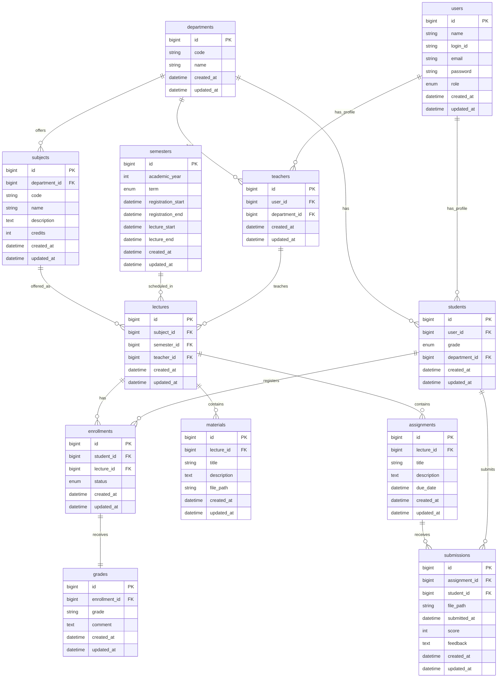
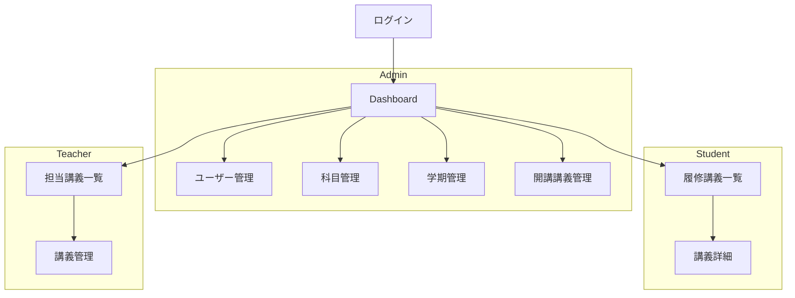

# CampusPortal

## 1. 解決したい課題

### 課題

- 履修登録、講義資料共有、課題提出、成績確認が別々のシステムで管理されている
- 利用目的ごとに複数サイトを行き来する必要がある
- 情報が分散しており履修計画が立てづらい
- 教員側も複数システムで管理業務を行う必要がある

### 解決方法

履修登録、講義管理、資料共有、課題提出、成績管理を単一のWebアプリケーションに統合し、学生・教員・管理者が大学生活に必要な操作を一元的に行える環境を提供する。

---

## 2. 想定ユーザ・ロール

| Role    | 権限                                             |
| ------- | ------------------------------------------------ |
| Admin   | ユーザー管理、科目管理、学期管理、開講講義管理   |
| Student | 履修登録、資料閲覧、課題提出、成績確認           |
| Teacher | 担当講義管理、資料管理、課題管理、採点、成績入力 |

---

## 3. 機能一覧

| 機能         | 内容               | 優先度 |
| ------------ | ------------------ | ------ |
| 認証         | Login / Logout     | 必須   |
| ユーザー管理 | CRUD               | 必須   |
| 科目管理     | CRUD               | 必須   |
| 学期管理     | CRUD               | 必須   |
| 開講講義管理 | CRUD               | 必須   |
| 履修登録     | 登録 / 取消        | 必須   |
| 講義資料共有 | Upload / Download  | 必須   |
| 課題管理     | 作成 / 提出 / 採点 | 必須   |
| 成績管理     | 入力 / 閲覧        | 必須   |
| 通知         | 締切通知、成績通知 | 推奨   |

---

## 4. DB設計



---

## 5. 画面構成・遷移



---

## 6. Route / Controller設計

### 認証

| Method | URI     | Controller            | 説明         |
| ------ | ------- | --------------------- | ------------ |
| GET    | /login  | AuthController@index  | ログイン画面 |
| POST   | /login  | AuthController@login  | ログイン処理 |
| POST   | /logout | AuthController@logout | ログアウト   |

---

### Admin

| Method | URI   | Controller           | 説明   |
| ------ | ----- | -------------------- | ------ |
| GET    | /home | HomeController@index | ホーム |

| Method | URI                | Controller                 | 説明 |
| ------ | ------------------ | -------------------------- | ---- |
| GET    | /students          | StudentController@index    | 一覧 |
| POST   | /students/import   | StudentController@store    | 入学 |
| POST   | /students/promote  | StudentController@promote  | 進級 |
| POST   | /students/graduate | StudentController@graduate | 卒業 |

| Method | URI              | Controller               | 説明 |
| ------ | ---------------- | ------------------------ | ---- |
| GET    | /teachers        | TeacherController@index  | 一覧 |
| POST   | /teachers/import | TeacherController@store  | 着任 |
| POST   | /teachers/resign | TeacherController@resign | 退任 |

| Method | URI                   | Controller                 | 説明 |
| ------ | --------------------- | -------------------------- | ---- |
| GET    | /semesters            | SemesterController@index   | 一覧 |
| POST   | /semesters            | SemesterController@store   | 作成 |
| PUT    | /semesters/{semester} | SemesterController@update  | 更新 |
| DELETE | /semesters/{semester} | SemesterController@destroy | 削除 |

| Method | URI                 | Controller                | 説明 |
| ------ | ------------------- | ------------------------- | ---- |
| POST   | /subjects           | SubjectController@store   | 作成 |
| PUT    | /subjects/{subject} | SubjectController@update  | 更新 |
| DELETE | /subjects/{subject} | SubjectController@destroy | 削除 |

| Method | URI                 | Controller                | 説明 |
| ------ | ------------------- | ------------------------- | ---- |
| POST   | /lectures           | LectureController@store   | 作成 |
| PUT    | /lectures/{lecture} | LectureController@update  | 更新 |
| DELETE | /lectures/{lecture} | LectureController@destroy | 削除 |

---

### Student

| Method | URI   | Controller           | 説明   |
| ------ | ----- | -------------------- | ------ |
| GET    | /home | HomeController@index | ホーム |

| Method | URI                       | Controller                   | 説明     |
| ------ | ------------------------- | ---------------------------- | -------- |
| POST   | /enrollments              | EnrollmentController@store   | 履修登録 |
| DELETE | /enrollments/{enrollment} | EnrollmentController@destroy | 履修取消 |

| Method | URI                                   | Controller                 | 説明     |
| ------ | ------------------------------------- | -------------------------- | -------- |
| POST   | /assignments/{assignment}/submissions | SubmissionController@store | 課題提出 |

---

### Teacher

| Method | URI   | Controller           | 説明   |
| ------ | ----- | -------------------- | ------ |
| GET    | /home | HomeController@index | ホーム |

| Method | URI                            | Controller                 | 説明     |
| ------ | ------------------------------ | -------------------------- | -------- |
| POST   | lectures/{lecture}/materials   | MaterialController@store   | 資料登録 |
| POST   | lectures/{lecture}/assignments | AssignmentController@store | 課題作成 |

| Method | URI                            | Controller                 | 説明     |
| ------ | ------------------------------ | -------------------------- | -------- |
| PUT    | submissions/{submission}/score | SubmissionController@score | 採点     |
| PUT    | enrollments/{enrollment}/grade | GradeController@store      | 成績入力 |

---

### 共通

| Method | URI                 | Controller              | 説明     |
| ------ | ------------------- | ----------------------- | -------- |
| GET    | /subjects           | SubjectController@index | 講義一覧 |
| GET    | /subjects/{subject} | SubjectController@show  | 講義詳細 |

| Method | URI                 | Controller              | 説明     |
| ------ | ------------------- | ----------------------- | -------- |
| GET    | /lectures           | LectureController@index | 開講一覧 |
| GET    | /lectures/{lecture} | LectureController@show  | 開講詳細 |

## 7. Model設計

```php
User
 ├─ hasOne(Student)
 ├─ hasOne(Teacher)

Student
 ├─ belongsTo(User)
 ├─ belongsTo(Department)
 ├─ hasMany(Enrollment)
 └─ hasMany(Submission)

Teacher
 ├─ belongsTo(User)
 ├─ belongsTo(Department)
 └─ hasMany(Lecture)

Department
 ├─ hasMany(Student)
 ├─ hasMany(Teacher)
 └─ hasMany(Subject)

Subject
 ├─ belongsTo(Department)
 └─ hasMany(Lecture)

Semester
 └─ hasMany(Lecture)

Lecture
 ├─ belongsTo(Subject)
 ├─ belongsTo(Semester)
 ├─ belongsTo(Teacher)
 ├─ hasMany(Enrollment)
 ├─ hasMany(Material)
 └─ hasMany(Assignment)

Enrollment
 ├─ belongsTo(Student)
 ├─ belongsTo(Lecture)
 └─ hasOne(Grade)

Assignment
 ├─ belongsTo(Lecture)
 └─ hasMany(Submission)

Submission
 ├─ belongsTo(Assignment)
 └─ belongsTo(Student)

Material
 └─ belongsTo(Lecture)

Grade
 └─ belongsTo(Enrollment)
```

---

## 8. Middleware

```txt
auth
role:admin
role:teacher
role:student
```

例:

```php
Route::middleware([
    'auth',
    'role:teacher'
]);
```

---

## 9. Validation設計（Laravel想定）

---

### ■ 共通ルール

- CSVインポートは「全件バリデーション → エラーがあれば全拒否」
- 部分成功は禁止（原則）
- 重複チェックはDB＋CSV両方で行う
- foreign key は事前存在チェック

---

## ■ User（共通アカウント）

### rules

- name: required|string|max:255
- email: required|email|unique:users,email
- login_id: required|string|unique:users,login_id
- password: required|string|min:8
- role: required|in:admin,student,teacher

---

## ■ Student（入学・CSV含む）

### rules

- user_id: required|exists:users,id
- department_id: required|exists:departments,id
- grade: required|integer|in:B1,B2,B3,B4,M1,M2,D1,D2,D3

### CSV追加ルール

- student_id: required|string|unique:users,login_id（または外部キーと整合）
- email: required|email|unique:users,email

---

## ■ Teacher（着任・CSV含む）

### rules

- user_id: required|exists:users,id
- department_id: required|exists:departments,id

### CSV追加ルール

- email: required|email|unique:users,email

---

## ■ Subject

### rules

- department_id: required|exists:departments,id
- code: required|string|unique:subjects,code
- name: required|string|max:255
- credits: required|integer|min:1|max:10

---

## ■ Semester

### rules

- academic_year: required|integer|min:2000
- term: required|in:spring,fall
- registration_start: required|date
- registration_end: required|date|after:registration_start
- lecture_start: required|date|after:registration_end
- lecture_end: required|date|after:lecture_start

---

## ■ Lecture

### rules

- subject_id: required|exists:subjects,id
- semester_id: required|exists:semesters,id
- teacher_id: required|exists:teachers,id

---

## ■ Enrollment

### rules

- student_id: required|exists:students,id
- lecture_id: required|exists:lectures,id
- status: required|in:registered,cancelled,completed

### business rule

- 同一 student_id + lecture_id の重複禁止（unique composite）

---

## ■ Assignment

### rules

- lecture_id: required|exists:lectures,id
- title: required|string|max:255
- due_date: required|date|after:now

---

## ■ Submission

### rules

- assignment_id: required|exists:assignments,id
- student_id: required|exists:students,id
- file_path: required|string
- submitted_at: nullable|date

### business rule

- 同一 student_id + assignment_id の重複禁止

---

## ■ Grade

### rules

- enrollment_id: required|exists:enrollments,id
- grade: required|in:A,B,C,D,F
- comment: nullable|string

---

## 10. 技術構成

### Backend

- Laravel 13

### Frontend

- Inertia.js
- React
- TailwindCSS

### Database

- MySQL 8

### Environment

- Docker
- Docker Compose

---

## 11. Docker起動方法

起動:

```bash
docker compose up -d --build
```

Laravel起動確認:

```bash
http://localhost:8080
```

migration:

```bash
docker compose exec app php artisan migrate
```

seed:

```bash
docker compose exec app php artisan db:seed
```

## 12. 開発ルール

---

## ■ コーディング規約

### Backend（Laravel）

- PSR-12準拠
- フォーマットツール：Laravel Pint

### Frontend（React）

- Airbnb JavaScript Style Guide準拠
- ESLint + Prettier使用

---

## ■ コミットルール

以下のプレフィックスを使用する：

- feat: 新機能追加
- fix: バグ修正
- docs: ドキュメント変更
- refactor: リファクタリング
- test: テスト追加・修正
- chore: その他雑務

---

## ■ Backend（Laravel）

### コードフォーマット（Pint）

```bash
docker compose exec app composer pint
```

---

## ■ Frontend（React）

### コード品質チェック（ESLint）

```bash
docker compose exec node npm run lint
```

### 自動修正（ESLint）

```bash
docker compose exec node npm run lint:fix
```

### フォーマット（Prettier）

```bash
docker compose exec node npm run format
```

### フォーマットチェック

```bash
docker compose exec node npm run format:check
```

### Lint + Format 一括チェック

```bash
docker compose exec node npm run check
```

---
