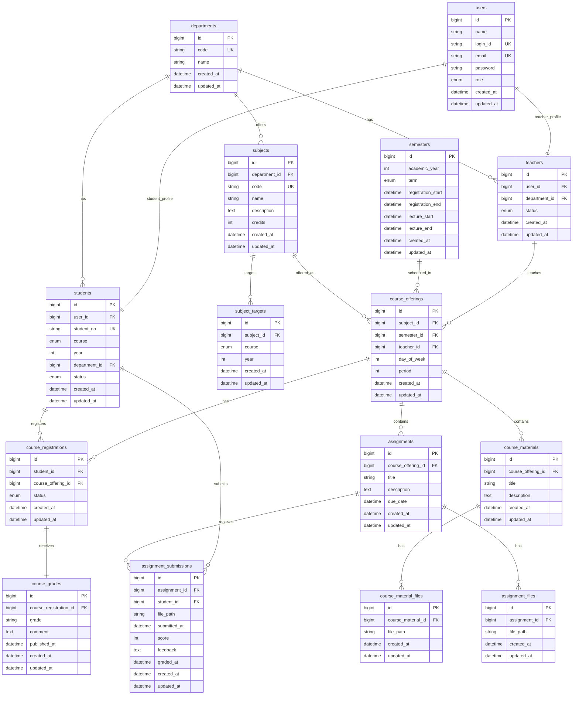
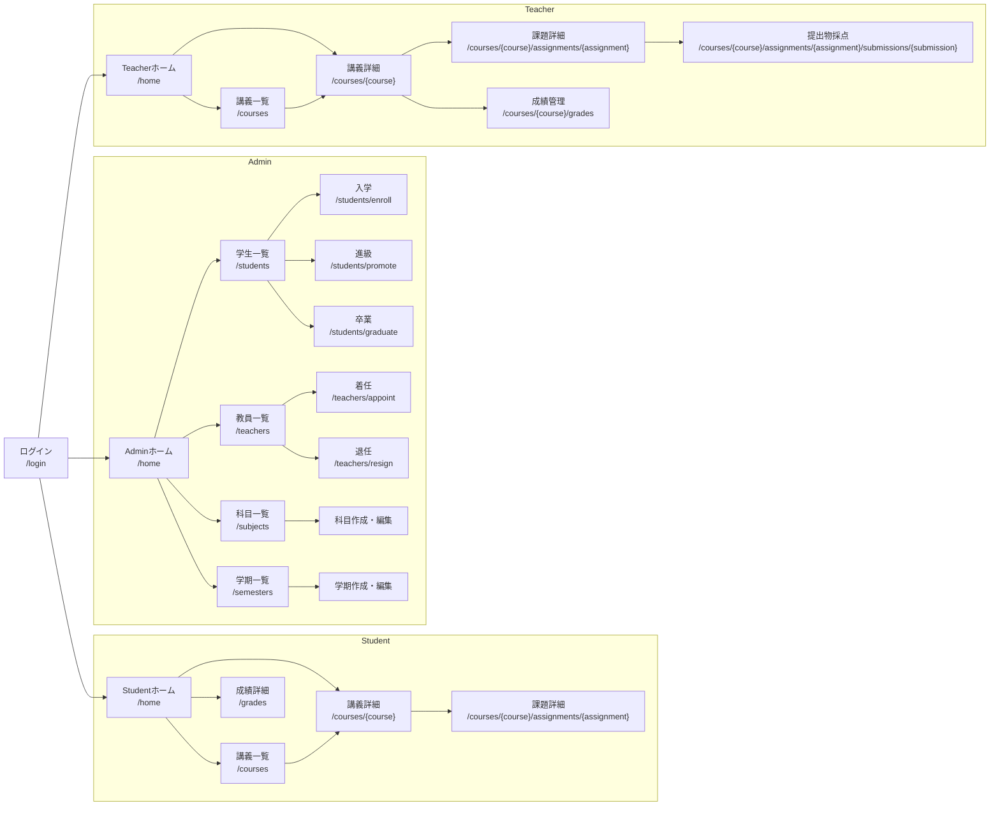

# CampusPortal

## 1. 解決したい課題

### 課題

- 履修登録、講義資料共有、課題提出、成績確認が別々のシステムで管理されている
- 利用目的ごとに複数サイトを行き来する必要がある
- 情報が分散しており履修計画が立てづらい
- 教員側も複数システムで管理業務を行う必要がある

### 解決方法

履修登録、講義管理、資料共有、課題提出、成績管理を単一のWebアプリケーションに統合し、学生・教員・管理者が大学生活に必要な操作を一元的に行える環境を提供する。

---

## 2. 想定ユーザ・ロール

| Role    | 権限                                             |
| ------- | ------------------------------------------------ |
| Admin   | ユーザー管理、科目管理、学期管理、開講講義管理   |
| Student | 履修登録、資料閲覧、課題提出、成績確認           |
| Teacher | 担当講義管理、資料管理、課題管理、採点、成績入力 |

---

## 3. 機能一覧

| 機能           | 内容                          | 優先度 |
| -------------- | ----------------------------- | ------ |
| 認証           | Login / Logout                | 必須   |
| 学生管理       | 入学 / 進級 / 卒業 / 一覧表示 | 必須   |
| 教員管理       | 着任 / 退任 / 一覧表示        | 必須   |
| 科目管理       | 作成 / 更新 / 削除            | 必須   |
| 学期管理       | 作成 / 更新 / 削除            | 必須   |
| 開講講義管理   | 作成 / 更新 / 削除            | 必須   |
| 講義検索・閲覧 | 講義一覧 / 講義詳細           | 必須   |
| 履修登録       | 登録 / 取消                   | 必須   |
| 時間割表示     | 履修中講義の時間割表示        | 必須   |
| 講義資料管理   | 資料作成 / 更新 / 削除        | 必須   |
| 講義資料閲覧   | 資料閲覧 / ダウンロード       | 必須   |
| 課題管理       | 作成 / 更新 / 削除            | 必須   |
| 課題提出       | 提出 / 再提出                 | 必須   |
| 課題採点       | 点数入力 / フィードバック     | 必須   |
| 成績管理       | 成績入力 / 公開               | 必須   |
| 成績閲覧       | 成績確認 / 単位確認           | 必須   |
| 通知           | 課題締切通知 / 成績公開通知   | 推奨   |

### ロール別機能

#### Admin

- 学生管理
- 教員管理
- 科目管理
- 学期管理
- 開講講義管理

#### Student

- 時間割表示
- 講義検索・閲覧
- 履修登録
- 資料閲覧
- 課題提出
- 成績閲覧

#### Teacher

- 担当講義管理
- 資料管理
- 課題管理
- 課題採点
- 成績管理

---

## 4. DB設計



### Enum定義

#### users.role

- admin（管理者）
- student（学生）
- teacher（教員）

#### students.course

- bachelor（学部）
- master（修士）
- doctor（博士）

#### students.status

- active（在学中）
- graduated（卒業）
- withdrawn（退学）

#### teachers.status

- active（在職中）
- resigned（退職済）

#### semesters.term

- first（1学期）
- second（2学期）
- third（3学期）

#### course_registrations.status

- registered（履修中）
- withdrawn（履修取消）
- completed（履修完了）

---

### テーブル概要

#### departments

学科マスタ。

例:

- 情報工学科
- 電気電子工学科
- 機械工学科

#### users

ログインユーザーを管理する。

- ログインID
- メールアドレス
- パスワード
- ロール（Admin / Student / Teacher）

を保持する。

#### students

学生固有情報を管理する。

- 学籍番号
- 段階（学部・修士・博士）
- 学年
- 所属学科
- 在籍状態

#### teachers

教員固有情報を管理する。

- 所属学科
- 在職状態

#### subjects

科目マスタ。

例:

- データベース論
- ソフトウェア工学
- 機械学習特論

#### subject_targets

科目の対象学年を管理する。

例:

- 学部3年
- 学部4年
- 修士1年

#### semesters

学期を管理する。

例:

- 2025年度 1学期
- 2025年度 2学期
- 2025年度 3学期

また、

- 履修登録期間
- 講義期間

を保持する。

#### course_offerings

実際に開講される講義を管理する。

例:

- データベース論
- 2025年度1学期
- 担当教員：山田太郎
- 火曜3限

Student の

- 時間割
- 講義一覧
- 講義詳細

Teacher の

- 担当講義一覧

はすべてこのテーブルを起点とする。

※ 開講状態（開講予定・開講中・終了）は `semester.lecture_start` と `semester.lecture_end` から算出する。

#### course_registrations

履修登録情報を管理する。

Student の

- 履修登録
- 履修取消

に対応する。

#### course_materials

講義資料を管理する。

Teacher が作成し、
Student が閲覧する。

#### course_material_files

講義資料の添付ファイルを管理する。

1つの資料に複数ファイルを添付可能。

#### assignments

課題を管理する。

Teacher が作成し、
Student が提出する。

#### assignment_files

課題の添付ファイルを管理する。

#### assignment_submissions

課題提出を管理する。

- 提出ファイル
- 提出日時
- 点数
- フィードバック

を保持する。

再提出時は同一レコードを更新する。

#### course_grades

講義ごとの最終成績を管理する。

Teacher が入力し、
`published_at` が設定された後に Student が閲覧可能となる。

---

### 主な制約

#### users

- login_id UNIQUE
- email UNIQUE

#### students

- student_no UNIQUE
- user_id UNIQUE

#### teachers

- user_id UNIQUE

#### subjects

- code UNIQUE

#### course_registrations

- UNIQUE(student_id, course_offering_id)

#### assignment_submissions

- UNIQUE(assignment_id, student_id)

#### course_grades

- UNIQUE(course_registration_id)

#### course_offerings

- UNIQUE(subject_id, semester_id, teacher_id)

---

## 5. 画面構成・遷移



### 共通

#### ログイン

- **URL**: `/login`
- **入力**
  - ログインID
  - パスワード
- **操作**
  - ログイン

---

### Admin

#### ホーム

- **URL**: `/home`
- **表示**
  - 学生管理
  - 教員管理
  - 科目管理
  - 学期管理

#### 学生管理

##### 学生一覧

- **URL**: `/students`
- **表示**
  - 学籍番号
  - 氏名
  - 学科
  - 段階（学部 / 修士 / 博士）
  - 学年
  - 単位数（取得済 / 履修中）
  - 状態（在学中 / 卒業 / 退学）
- **操作**
  - 入学
  - 進級
  - 卒業

##### 入学

- **URL**: `/students/enroll`
- **入力**
  - 段階
  - 学年
  - 学科
  - 入学者CSV（student_no, name, email）
- **操作**
  - 登録

##### 進級

- **URL**: `/students/promote`
- **入力**
  - 進級者CSV（student_no）
- **操作**
  - 進級

##### 卒業

- **URL**: `/students/graduate`
- **入力**
  - 卒業者CSV（student_no）
- **操作**
  - 卒業

#### 教員管理

##### 教員一覧

- **URL**: `/teachers`
- **表示**
  - 氏名
  - 学科
  - 状態（在職中 / 退職済）
- **操作**
  - 着任
  - 退任

##### 着任

- **URL**: `/teachers/appoint`
- **入力**
  - 学科
  - 氏名
  - メールアドレス
- **操作**
  - 登録

##### 退任

- **URL**: `/teachers/resign`
- **入力**
  - メールアドレス
- **操作**
  - 退任

#### 科目管理

##### 科目一覧

- **URL**: `/subjects`
- **表示**
  - 科目コード
  - 科目名
  - 学科
  - 単位数
- **操作**
  - 作成
  - 編集
  - 削除

##### 科目作成・編集

- **URL**
  - `/subjects/create`
  - `/subjects/{subject}/edit`
- **入力**
  - 対象学科
  - 対象段階
  - 対象学年
  - 科目コード
  - 科目名
  - 単位数
  - 説明
- **操作**
  - 保存

#### 学期管理

##### 学期一覧

- **URL**: `/semesters`
- **表示**
  - 学年
  - 学期
  - 履修登録期間
  - 講義期間
- **操作**
  - 作成
  - 編集

##### 学期作成・編集

- **URL**
  - `/semesters/create`
  - `/semesters/{semester}/edit`
- **入力**
  - 学年
  - 学期
  - 履修登録開始日時
  - 履修登録終了日時
  - 講義開始日時
  - 講義終了日時
  - 開講講義CSV（subject_code, teacher_login_id）
- **操作**
  - 保存

---

### Student

#### ホーム

- **URL**: `/home`
- **表示**
  - 履修中科目の時間割
  - 単位数（取得済 / 履修中）
- **操作**
  - 履修登録（登録期間中のみ）
  - 講義一覧
  - 成績確認

#### 講義一覧

- **URL**: `/courses`
- **表示**
  - 科目コード
  - 科目名
  - 担当教員
  - 学期
  - 開講状態（開講中 / 開講予定 / 未開講）
- **操作**
  - 講義詳細

#### 講義詳細

- **URL**: `/courses/{course}`
- **表示**
  - 科目名
  - 担当教員
  - 科目概要
  - 単位数
  - 開講学期
  - 開講状態
- **表示（履修中かつ開講中）**
  - 資料一覧
  - 課題一覧
- **操作**
  - 資料ダウンロード
  - 課題提出

#### 課題詳細

- **URL**: `/courses/{course}/assignments/{assignment}`
- **表示**
  - 課題説明
  - 提出期限
  - 提出状況
- **入力**
  - 提出ファイル
- **操作**
  - 提出
  - 再提出（期限内のみ）

#### 成績詳細

- **URL**: `/grades`
- **表示**
  - 取得済単位数
  - 履修中単位数
  - 科目別成績
- **操作**
  - 学期絞り込み

---

### Teacher

#### ホーム

- **URL**: `/home`
- **表示**
  - 担当講義一覧
  - 未採点課題数
- **操作**
  - 講義選択
  - 講義一覧

#### 講義一覧

- **URL**: `/courses`
- **表示**
  - 科目コード
  - 科目名
  - 学期
  - 受講者数
  - 開講状態
- **操作**
  - 講義詳細

#### 講義詳細

- **URL**: `/courses/{course}`
- **表示**
  - 科目情報
  - 受講学生一覧
  - 資料一覧
  - 課題一覧
- **操作**
  - 資料管理
  - 課題管理
  - 成績管理

#### 課題詳細

- **URL**: `/courses/{course}/assignments/{assignment}`
- **表示**
  - 課題情報
  - 提出状況一覧
- **操作**
  - 提出物確認
  - 採点

#### 提出物採点

- **URL**: `/courses/{course}/assignments/{assignment}/submissions/{submission}`
- **表示**
  - 学生情報
  - 提出ファイル
- **入力**
  - 点数
  - フィードバック
- **操作**
  - 保存

#### 成績管理

- **URL**: `/courses/{course}/grades`
- **表示**
  - 受講学生一覧
  - 課題点
  - 総合評価
- **入力**
  - 最終成績
- **操作**
  - 保存
  - 公開

---

## 6. Route / Controller設計

### 認証

| Method | URI     | Controller            | 説明         |
| ------ | ------- | --------------------- | ------------ |
| GET    | /login  | AuthController@index  | ログイン画面 |
| POST   | /login  | AuthController@login  | ログイン処理 |
| POST   | /logout | AuthController@logout | ログアウト   |

---

## Admin

### ホーム

| Method | URI   | Controller           | 説明   |
| ------ | ----- | -------------------- | ------ |
| GET    | /home | HomeController@index | ホーム |

### 学生管理

| Method | URI                | Controller                 | 説明     |
| ------ | ------------------ | -------------------------- | -------- |
| GET    | /students          | StudentController@index    | 学生一覧 |
| POST   | /students/enroll   | StudentController@enroll   | 入学     |
| POST   | /students/promote  | StudentController@promote  | 進級     |
| POST   | /students/graduate | StudentController@graduate | 卒業     |

### 教員管理

| Method | URI               | Controller                | 説明     |
| ------ | ----------------- | ------------------------- | -------- |
| GET    | /teachers         | TeacherController@index   | 教員一覧 |
| POST   | /teachers/appoint | TeacherController@appoint | 着任     |
| POST   | /teachers/resign  | TeacherController@resign  | 退任     |

### 科目管理

| Method | URI                 | Controller                | 説明     |
| ------ | ------------------- | ------------------------- | -------- |
| GET    | /subjects           | SubjectController@index   | 科目一覧 |
| POST   | /subjects           | SubjectController@store   | 科目作成 |
| PUT    | /subjects/{subject} | SubjectController@update  | 科目更新 |
| DELETE | /subjects/{subject} | SubjectController@destroy | 科目削除 |

### 学期管理

| Method | URI                   | Controller                 | 説明     |
| ------ | --------------------- | -------------------------- | -------- |
| GET    | /semesters            | SemesterController@index   | 学期一覧 |
| POST   | /semesters            | SemesterController@store   | 学期作成 |
| PUT    | /semesters/{semester} | SemesterController@update  | 学期更新 |
| DELETE | /semesters/{semester} | SemesterController@destroy | 学期削除 |

### 開講講義管理

| Method | URI                          | Controller                       | 説明         |
| ------ | ---------------------------- | -------------------------------- | ------------ |
| GET    | /course-offerings            | CourseOfferingController@index   | 開講講義一覧 |
| POST   | /course-offerings            | CourseOfferingController@store   | 開講登録     |
| PUT    | /course-offerings/{offering} | CourseOfferingController@update  | 開講更新     |
| DELETE | /course-offerings/{offering} | CourseOfferingController@destroy | 開講削除     |

---

## Student

### ホーム

| Method | URI   | Controller           | 説明   |
| ------ | ----- | -------------------- | ------ |
| GET    | /home | HomeController@index | ホーム |

### 講義

| Method | URI                 | Controller             | 説明     |
| ------ | ------------------- | ---------------------- | -------- |
| GET    | /courses            | CourseController@index | 講義一覧 |
| GET    | /courses/{offering} | CourseController@show  | 講義詳細 |

### 履修登録

| Method | URI                                  | Controller                           | 説明     |
| ------ | ------------------------------------ | ------------------------------------ | -------- |
| POST   | /course-registrations                | CourseRegistrationController@store   | 履修登録 |
| DELETE | /course-registrations/{registration} | CourseRegistrationController@destroy | 履修取消 |

### 課題提出

| Method | URI                                  | Controller                            | 説明     |
| ------ | ------------------------------------ | ------------------------------------- | -------- |
| POST   | /assignments/{assignment}/submission | AssignmentSubmissionController@store  | 課題提出 |
| PUT    | /assignments/{assignment}/submission | AssignmentSubmissionController@update | 再提出   |

### 成績

| Method | URI     | Controller            | 説明     |
| ------ | ------- | --------------------- | -------- |
| GET    | /grades | GradeController@index | 成績一覧 |

---

## Teacher

### ホーム

| Method | URI   | Controller           | 説明   |
| ------ | ----- | -------------------- | ------ |
| GET    | /home | HomeController@index | ホーム |

### 講義

| Method | URI                 | Controller             | 説明         |
| ------ | ------------------- | ---------------------- | ------------ |
| GET    | /courses            | CourseController@index | 担当講義一覧 |
| GET    | /courses/{offering} | CourseController@show  | 講義詳細     |

### 資料管理

| Method | URI                           | Controller                       | 説明     |
| ------ | ----------------------------- | -------------------------------- | -------- |
| POST   | /courses/{offering}/materials | CourseMaterialController@store   | 資料作成 |
| PUT    | /materials/{material}         | CourseMaterialController@update  | 資料更新 |
| DELETE | /materials/{material}         | CourseMaterialController@destroy | 資料削除 |

### 課題管理

| Method | URI                             | Controller                   | 説明     |
| ------ | ------------------------------- | ---------------------------- | -------- |
| POST   | /courses/{offering}/assignments | AssignmentController@store   | 課題作成 |
| PUT    | /assignments/{assignment}       | AssignmentController@update  | 課題更新 |
| DELETE | /assignments/{assignment}       | AssignmentController@destroy | 課題削除 |

### 採点

| Method | URI                                        | Controller                           | 説明     |
| ------ | ------------------------------------------ | ------------------------------------ | -------- |
| PUT    | /assignment-submissions/{submission}/grade | AssignmentSubmissionController@grade | 課題採点 |

### 成績管理

| Method | URI                            | Controller              | 説明     |
| ------ | ------------------------------ | ----------------------- | -------- |
| GET    | /courses/{offering}/grades     | GradeController@index   | 成績一覧 |
| PUT    | /course-grades/{grade}         | GradeController@update  | 成績入力 |
| PUT    | /course-grades/{grade}/publish | GradeController@publish | 成績公開 |

---

## 共通

### 講義一覧・講義詳細

| Method | URI                 | Controller             | 説明     |
| ------ | ------------------- | ---------------------- | -------- |
| GET    | /courses            | CourseController@index | 講義一覧 |
| GET    | /courses/{offering} | CourseController@show  | 講義詳細 |

---

## 7. Model設計

```php
User
 ├─ hasOne(Student)
 └─ hasOne(Teacher)

Student
 ├─ belongsTo(User)
 ├─ belongsTo(Department)
 ├─ hasMany(CourseRegistration)
 └─ hasMany(AssignmentSubmission)

Teacher
 ├─ belongsTo(User)
 ├─ belongsTo(Department)
 └─ hasMany(CourseOffering)

Department
 ├─ hasMany(Student)
 ├─ hasMany(Teacher)
 └─ hasMany(Subject)

Subject
 ├─ belongsTo(Department)
 ├─ hasMany(SubjectTarget)
 └─ hasMany(CourseOffering)

SubjectTarget
 └─ belongsTo(Subject)

Semester
 └─ hasMany(CourseOffering)

CourseOffering
 ├─ belongsTo(Subject)
 ├─ belongsTo(Semester)
 ├─ belongsTo(Teacher)
 ├─ hasMany(CourseRegistration)
 ├─ hasMany(CourseMaterial)
 └─ hasMany(Assignment)

CourseRegistration
 ├─ belongsTo(Student)
 ├─ belongsTo(CourseOffering)
 └─ hasOne(CourseGrade)

CourseGrade
 └─ belongsTo(CourseRegistration)

CourseMaterial
 ├─ belongsTo(CourseOffering)
 └─ hasMany(CourseMaterialFile)

CourseMaterialFile
 └─ belongsTo(CourseMaterial)

Assignment
 ├─ belongsTo(CourseOffering)
 ├─ hasMany(AssignmentFile)
 └─ hasMany(AssignmentSubmission)

AssignmentFile
 └─ belongsTo(Assignment)

AssignmentSubmission
 ├─ belongsTo(Assignment)
 └─ belongsTo(Student)
```

---

## 8. Middleware

```txt
auth
role:admin
role:teacher
role:student
```

例:

```php
Route::middleware([
    'auth',
    'role:teacher'
]);
```

---

## 9. Validation設計（Laravel想定）

---

### ■ 共通ルール

- CSVインポートは全件バリデーション成功時のみ登録
- 部分成功は禁止
- CSV内重複チェックを行う
- DB重複チェックを行う
- foreign key は exists で存在確認する
- 更新時は自身を除外して unique チェックを行う

---

## ■ User

### rules

- name: required|string|max:255
- login_id: required|string|max:255|unique:users,login_id
- email: required|email|max:255|unique:users,email
- password: required|string|min:8
- role: required|in:admin,student,teacher

---

## ■ Student

### rules

- user_id: required|exists:users,id
- student_no: required|string|max:255|unique:students,student_no
- course: required|in:bachelor,master,doctor
- year: required|integer|min:1|max:6
- department_id: required|exists:departments,id
- status: required|in:active,graduated,withdrawn

### 入学CSV

#### rules

- student_no: required|string
- name: required|string|max:255
- email: required|email

### business rule

- CSV内の student_no 重複禁止
- CSV内の email 重複禁止
- users.email 重複禁止
- users.login_id 重複禁止
- login_id は email のローカル部（@より前）を利用する

---

## ■ Teacher

### rules

- user_id: required|exists:users,id
- department_id: required|exists:departments,id
- status: required|in:active,resigned

### 着任

#### rules

- name: required|string|max:255
- email: required|email

### business rule

- users.email 重複禁止
- users.login_id 重複禁止
- login_id は email のローカル部を利用する

---

## ■ Department

### rules

- code: required|string|max:50|unique:departments,code
- name: required|string|max:255

---

## ■ Subject

### rules

- department_id: required|exists:departments,id
- code: required|string|max:50|unique:subjects,code
- name: required|string|max:255
- description: nullable|string
- credits: required|integer|min:1|max:20

---

## ■ SubjectTarget

### rules

- subject_id: required|exists:subjects,id
- course: required|in:bachelor,master,doctor
- year: required|integer|min:1|max:6

### business rule

- 同一 subject_id + course + year の重複禁止

---

## ■ Semester

### rules

- academic_year: required|integer|min:2000
- term: required|in:first,second,third
- registration_start: required|date
- registration_end: required|date|after:registration_start
- lecture_start: required|date|after:registration_end
- lecture_end: required|date|after:lecture_start

### business rule

- academic_year + term の重複禁止

---

## ■ CourseOffering

### rules

- subject_id: required|exists:subjects,id
- semester_id: required|exists:semesters,id
- teacher_id: required|exists:teachers,id
- day_of_week: required|integer|between:1,7
- period: required|integer|min:1|max:8

### business rule

- 同一 subject_id + semester_id + teacher_id の重複禁止
- 同一 teacher が同一時限に複数講義を担当できない
- 対象学年・対象課程に合う教員のみ割当可能

---

## ■ CourseRegistration

### rules

- student_id: required|exists:students,id
- course_offering_id: required|exists:course_offerings,id
- status: required|in:registered,withdrawn,completed

### business rule

- 同一 student_id + course_offering_id の重複禁止
- 履修登録期間内のみ登録・取消可能
- 対象学年・対象課程外の科目は履修不可
- 同一時間帯の講義は重複履修不可

---

## ■ CourseMaterial

### rules

- course_offering_id: required|exists:course_offerings,id
- title: required|string|max:255
- description: nullable|string

---

## ■ CourseMaterialFile

### rules

- course_material_id: required|exists:course_materials,id
- file_path: required|string

### business rule

- 許可拡張子のみアップロード可能
- ファイルサイズ上限を設定する

---

## ■ Assignment

### rules

- course_offering_id: required|exists:course_offerings,id
- title: required|string|max:255
- description: required|string
- due_date: required|date

### business rule

- due_date は講義終了日時以前
- 開講中講義のみ作成可能

---

## ■ AssignmentFile

### rules

- assignment_id: required|exists:assignments,id
- file_path: required|string

### business rule

- 許可拡張子のみアップロード可能
- ファイルサイズ上限を設定する

---

## ■ AssignmentSubmission

### rules

- assignment_id: required|exists:assignments,id
- student_id: required|exists:students,id
- file_path: required|string

### business rule

- 同一 assignment_id + student_id の重複禁止
- 再提出時は既存レコードを更新
- 履修者のみ提出可能
- 提出期限後は提出不可

---

## ■ CourseGrade

### rules

- course_registration_id: required|exists:course_registrations,id
- grade: required|in:A,B,C,D,F
- comment: nullable|string

### business rule

- 同一 course_registration_id の重複禁止
- 担当教員のみ更新可能
- 公開後は学生が閲覧可能

---

## 10. 技術構成

### Backend

- Laravel 13

### Frontend

- Inertia.js
- React
- TailwindCSS

### Database

- MySQL 8

### Environment

- Docker
- Docker Compose

---

## 11. Docker起動方法

起動:

```bash
docker compose up -d --build
```

Laravel起動確認:

```bash
http://localhost:8080
```

migration:

```bash
docker compose exec app php artisan migrate
```

seed:

```bash
docker compose exec app php artisan db:seed
```

Ziggyの型生成:

```bash
docker compose exec app composer ziggy
```

## 12. 開発ルール

---

## ■ コーディング規約

### Backend（Laravel）

- PSR-12準拠
- フォーマットツール：Laravel Pint

### Frontend（React）

- Airbnb JavaScript Style Guide準拠
- ESLint + Prettier使用

---

## ■ コミットルール

以下のプレフィックスを使用する：

- feat: 新機能追加
- fix: バグ修正
- docs: ドキュメント変更
- refactor: リファクタリング
- test: テスト追加・修正
- chore: その他雑務

---

## ■ Backend（Laravel）

### コードフォーマット（Pint）

```bash
docker compose exec app composer pint
```

---

## ■ Frontend（React）

### コード品質チェック（ESLint）

```bash
docker compose exec node npm run lint
```

### 自動修正（ESLint）

```bash
docker compose exec node npm run lint:fix
```

### フォーマット（Prettier）

```bash
docker compose exec node npm run format
```

### フォーマットチェック

```bash
docker compose exec node npm run format:check
```

### Lint + Format 一括チェック

```bash
docker compose exec node npm run check
```

---
